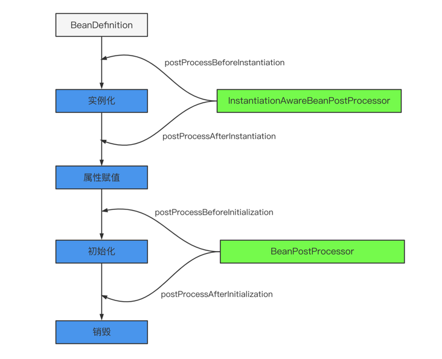
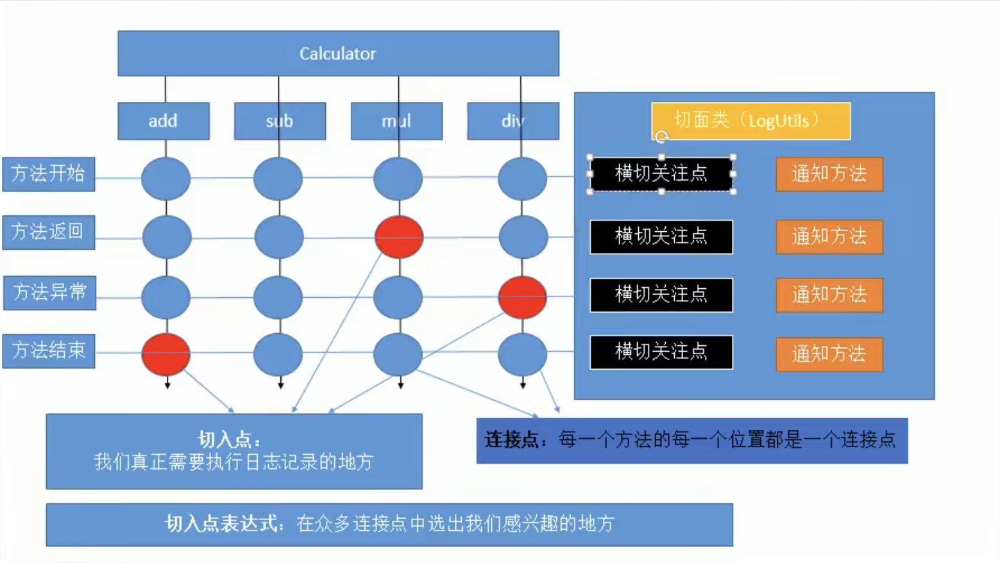
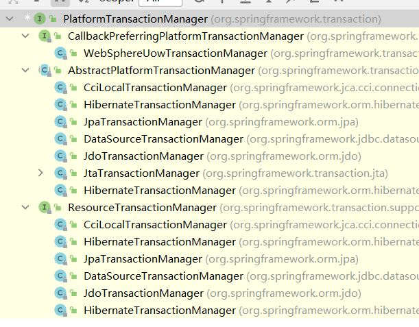
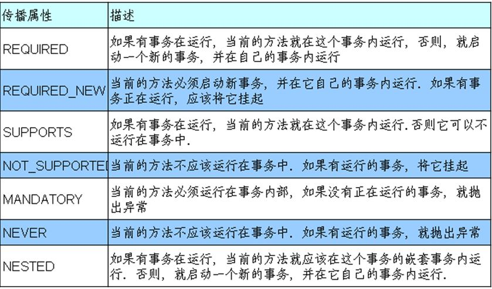
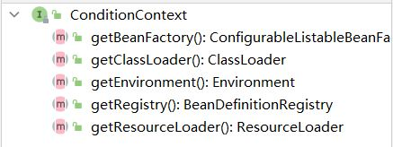

## 导言
- 框架
	- 高度抽取可重用代码的一种设计；高度的通用性
	- 多个可充用模块的集合，形成一个整体的解决方案

- Spring框架
	- 容器框架    
	- EJB(enterprise java bean)---->Spring  
	- IOC(思想) 和 AOP <span style="color: red;font-size: 20px">DI(具体的实现方法) 就是控制反转IOC 的最经典的实现 </span>

- Spring的优良特性
	- 非侵入式：基于Spring开发的应用中的对象可以不依赖于Spring的API
	- 依赖注入：DI——Dependency Injection，反转控制(IOC)最经典的实现。
	- 面向切面编程：Aspect Oriented Programming——AOP
	- 容器：Spring是一个容器，因为它包含并且管理应用对象的生命周期
	- 组件化：Spring实现了使用简单的组件配置组合成一个复杂的应用。在 Spring 中可以使用XML和Java注解组合这些对象。
	- 一站式：在IOC和AOP的基础上可以整合各种企业应用的开源框架和优秀的第三方类库（实际上Spring 自身也提供了表述层的SpringMVC和持久层的Spring JDBC）。


## Spring

- spring框架信息
	
	 
	
	- Test：单元测试模块
	- Core Container： 核心容器 由 bean,core,context,speljar包组成
	- AOP Aspect： 面向切面
	- Data Access/Integration: 数据访问以及集成 jdbc , orm , transactions jar 	
	- Web: spring-web-4.0.0.RELEASE 与web原生开发有关，servlet之类。spring-webmvc-4.0.0.RELEASE


- IOC(inversion of Control)
	- 获取资源的方式：
		- 主动式：自己new出来
		- 被动式：资源不是自己创建，而是交给容器创建管理
		- 复杂对象的创建是比较庞大的功能
	- 容器：管理所有的组件，自动探明组件之间的依赖，并且注入解决

- DI(Dependency Injection) 依赖注入
	- 容器自动解决依赖

- 容器管理的组件，可以使用容器的强大功能

- 框架编写的流程
	- 导包
	- 写配置
		+ spring bean Configuration file
	- 测试

- BeanFactory 和 ApplicationContext
	- BeanFactory提供了最基本的容器功能(获取bean之类)但是已经很古老了，也不支持新特性。
	- ApplicationContext是一个比较好的的容器实现
	
- 容器中对象创建的时机
	+ 单例对象(singleton)在容器创建的时候就创建了
	- 原型对象在请求的时候才创建
	- 对象的赋值是通过getter setter 方法实现的，其参数名字也是由setter方法确定的


	- ClassPathXmlApplicationContext ioc容器的配置问价在类的路径之下
	- FileSystem							在磁盘路径下面
	- bean在容器创建的时候就创建好了，单实例，property赋值是调用get，set方法。

- p名称空间

- 复杂类型赋值
	+ bean 可以创建内部对象，也可以引用
	+ list 用 list标签 赋值，ref标签可以引用bean
	+ map 使用 map标签 赋值，entry标签可以赋值
	+ Properties props标签
	+ 这里必须重新看xml的定义，然后去看看xml dtd就都知道了

- util名称空间

```xml
实验6：通过继承实现bean配置信息的重用 
parent
<bean id="person01" class="com.guo.learningspring.Person">
        <property name="name" value="张三"/>
        <property name="age" value="34"/>
        <property name="gender" value="男"/>
        <property name="email" value="asdfasd@emil.com"/>
    </bean>
    <bean class="com.guo.learningspring.Person" id="person06" parent="person01">
        
    </bean>


实验7：通过abstract属性创建一个模板bean   
abstract

实验8：bean之间的依赖 
bean的创建顺序是按照文件读的顺序
使用depends-on来改变创建顺序


实验9：测试bean的作用域，分别创建单实例和多实例的bean★
scope: prototype 多实例,request同一次请求创建一个,session同一个session创建一个,singleton 单实例
多实例在容器启动的时候不会默认创建，单实例则相反


实验5：配置通过静态工厂方法创建的bean、实例工厂方法创建的bean、FactoryBean★
静态工厂：工厂本身不需要创建对象，通过静态方法调用
实例工厂：工厂本身需要创建对象
静态直接: <bean id="person02" class="com.guo.learningspring.bean.PersonFactory" factory-method="produce">
动态需要先设置bean，再设置下面两个属性
factory-bean factory-method

FactoryBean(是Spring规定的一个接口)只要实现了一个这个接口的类，Spring都认识
配置的时候就不用写factory-method了


实验10：创建带有生命周期方法的bean
声明周期：	bean的创建到销毁；
			ioc容器中注册的bean：
				1. 单实例bean，容器启动的时候就创建好
				2. 多实例的bean，在获取的时候才创建
			可以为bean自定义一些生命周期的方法，Spring在创建或者销毁的时候会调用指定的方法
			bean-->destory-method,init-method

			scope="prototype" 容器关闭不会销毁，单实例会调用destory-method
```
- 子接口里声明了父接口的方法
	+ 方法都是没有实现的，功能层面没有意义
	+ 子方法不能更改父方法的访问修饰权限，都是public
	+ 不能跑出更多的异常
	+ 只是为了提醒你，易读性

- bean的声明周期
	
	- 实例化
	- 属性赋值
	- 初始化
	- 销毁
- 两个类，两兄弟
	+ BeanPostProcessor
	- InstantiationAwareBeanPostProcessor
- bean 自己的init-method 和 destory-method
	+ 单实例，容器会帮你调用初始化和销毁方法
	+ 多实例不会帮你调用销毁方法


```

实验11：测试bean的后置处理器
BeanPostProcessor
在bean的初始化前后调用方法；


实验12：引用外部属性文件★
数据库连接池作为单实例是最好的，可以让Spring来帮我们创建数据链接池对象
依赖context的名称空间
 <context:property-placeholder location="classpath:jdbc.properties"/>


实验13：基于XML的自动装配（自定义类型自动赋值）
javaBean  bean --> autowire = default 不自动装配
							  byName  按照名字去寻找
							  byType  按照类型去寻找
							  constructor 按照构造器的类型进行赋值 不会报错
							  no   


实验14：[SpEL测试I]
    在SpEL中使用字面量、
    引用其他bean、
    引用其他bean的某个属性值、
    调用非静态方法
    调用静态方法、
    使用运算符


实验15：通过注解分别创建Dao、Service、Controller★
Spring有四个注解
	@Controller
	@Service
	@Repository (数据库层，持久化层，dao)
	@Component
	1) 给要添加的组件上标四个注解的任何一个
	2）告诉spring，自动扫描添加了注解的组件，依赖context名称空间
	3） id就是默认类名首字母小写，一定要导入aop包，其实现了支持注解
	@Scope可以调整作用域


实验16：使用context:include-filter指定扫描包时要包含的类
实验17：使用context:exclude-filter指定扫描包时不包含的类
type：	annotation
		assignable
		aspectj
		custom
		regex


实验18：使用@Autowired注解实现根据类型实现自动装配★


实验19：如果资源类型的bean不止一个，
        默认根据@Autowired注解标记的成员变量名作为id查找bean，进行装配★


实验20：如果根据成员变量名作为id还是找不到bean，
        可以使用@Qualifier注解明确指定目标bean的id★

实验21：在方法的形参位置使用@Qualifier注解


实验22：@Autowired注解的required属性指定某个属性允许不被设置
@Resource，@Inject 只有autowire最强大


实验23：测试泛型依赖注入★
	

```

### Spring测试
- @ContextConfiguration(locations="")
	@RunWith(SpringJUnit4ClassRunner.class)//使用spring的单元测试方法


### AOP
-Aspect Oriented Programming
新的编程思想，基于oop的
<span style="color: red">在程序运行期间，将某段代码动态的切入到指定方法的指定位置进行运行的这种编程方式</span>

- 例子： 日志记录  <br>
	- 写在代码里
	- 在运行期间动态加上
	- 代理的设计模式 <span style="color: red;font-size: 20px">Proxy</span>
	- 动态代理写起来太麻烦，jdk默认的动态代理，如果对象没有接口，则创建不出来

- AOP底层就是动态代理
- 可以用spring一句也不写来创建动态代理，没有强制要求必须实现接口


- AOP专业术语



- 注解和切入点表达式
- 只是一个通知方法，不影响程序运行就用普通通知

- @Before：前置通知，在方法执行之前执行
- @After：后置通知，在方法执行之后执行
- @AfterReturning：返回通知，在方法返回结果之后执行
- @AfterThrowing：异常通知，在方法抛出异常之后执行

- 如果要实现动态代理的功能就使用环绕通知
- @Around：环绕通知，围绕着方法执行
	最强大的通知方法，就是手写的动态代理
	就是因为有JoinPoint 可以获得参数，调用方法。
	环绕通知优先


- @Order可以改变切面顺序，数字越小，越优先

- execution([权限修饰符] [返回值类型] [简单类名/全类名] [方法名] （参数列表))


执行顺序
https://www.cnblogs.com/suizhikuo/p/13927596.html


1. ..,任意参数，任意层路径 


2. \*，权限位置不行。不写就是匹配所有权限


3. ioc里面存的是代理对象 java.sun.proxy,所以不能通过子类class获取


4. 没有接口就是自己的类型，cglib ，内部类


5. JoinPoint


6. 切入点表达式的重用 重新定义一个方法

#### AOP的使用场景

- AOP加日志保存在数据库中；
- 做权限认证；
- 做安全检查；
- 做事务控制；

#### 基于注解的AOP 步骤
- 将目标类和切面类加入到IOC容器中，@Component @Aspect
- 在切面类中使用五个通知注解来 before after afterreturnning afterthrowing around
- 开启包扫描，和aop功能

#### 基于配置的AOP
- 与上面差不多，不过是用配置的模式
- bean，aop:config-->aop:aspect-->aop:before pointcut

- 注解的优点是快速方便
- 配置是全部解耦和，不需要在源代码里面写。
- 所有重要的用配置，不重要的用注解

#### JDBCTemplate


#### 声明式事务
    
Spring 提供了JDBCTemplate可以快捷操作事务    


- 编程式事务
- 声明式事务
	- 加一个注解，通过aop实现
	- 配置事务管理器，注入到ioc中
	- 开启基于注解的事务控制模式
	


- @Transaction
- String[] 						noRollbackForClassName() 		
- Class<? extends Throwable>[] 	noRollbackFor()  哪些事务不回 				
- String[] 						rollbackForClassName()		 	
- Class<? extends Throwable>[] 	rollbackFor()  哪些异常事务需要回滚 					
- boolean 						readOnly()  只读属性 					default false;
- int 							timeout()  超时 						default TransactionDefinition.TIMEOUT_DEFAULT;
- Isolation 						isolation()  隔离级别 					default Isolation.DEFAULT;
- Propagation 					propagation()  传播行为					default Propagation.REQUIRED;
- String 							value() 						

- 事务的回滚默认编译时异常不会回滚
- noRollbackFor() 原来回滚的异常设置为不回滚 
- rollbackFor() 原来不会滚的设置为回滚
- 传播行为，当大事务包含两个小事务的时候应该怎么处理
- 


### IOC 源码分析
AOP 的源码就是动态代理

1. ioc是一个容器
2. 启动的时候创建所有单实例对象
3. 我们可以从容器中获取对象

1. ioc的启动过程
	最开始就是验证，然后就创建bean
	refresh() 核心就在这个方法里

BeanFactory和ApplicationContext的区别：
	1. ApplicationContext是BeanFactory的子接口
		BeanFactory是bean工厂接口，负责创建bean实例；容器里面保存的所有单例bean其实是一个map
		ApplicationContext是容器的接口；更多的负责容器功能的实现；可以基于beanFactory创建好的对象上完成强大的容器
		Spring里面最大的模式就是工厂模式

```java
for (String beanName : beanNames) {
			RootBeanDefinition bd = getMergedLocalBeanDefinition(beanName);
			if (!bd.isAbstract() && bd.isSingleton() && !bd.isLazyInit()) {
				if (isFactoryBean(beanName)) {
					final FactoryBean<?> factory = (FactoryBean<?>) getBean(FACTORY_BEAN_PREFIX + beanName);
					boolean isEagerInit;
					if (System.getSecurityManager() != null && factory instanceof SmartFactoryBean) {
						isEagerInit = AccessController.doPrivileged(new PrivilegedAction<Boolean>() {
							@Override
							public Boolean run() {
								return ((SmartFactoryBean<?>) factory).isEagerInit();
							}
						}, getAccessControlContext());
					}
					else {
						isEagerInit = (factory instanceof SmartFactoryBean &&
								((SmartFactoryBean<?>) factory).isEagerInit());
					}
					if (isEagerInit) {
						getBean(beanName);
					}
				}
				else {
					getBean(beanName);
				}
			}
		}
```

```java
protected <T> T doGetBean(
			final String name, final Class<T> requiredType, final Object[] args, boolean typeCheckOnly)
			throws BeansException {

		final String beanName = transformedBeanName(name);
		Object bean;

		// Eagerly check singleton cache for manually registered singletons.
		Object sharedInstance = getSingleton(beanName);
		if (sharedInstance != null && args == null) {
			if (logger.isDebugEnabled()) {
				if (isSingletonCurrentlyInCreation(beanName)) {
					logger.debug("Returning eagerly cached instance of singleton bean '" + beanName +
							"' that is not fully initialized yet - a consequence of a circular reference");
				}
				else {
					logger.debug("Returning cached instance of singleton bean '" + beanName + "'");
				}
			}
			bean = getObjectForBeanInstance(sharedInstance, name, beanName, null);
		}

		else {
			// Fail if we're already creating this bean instance:
			// We're assumably within a circular reference.
			if (isPrototypeCurrentlyInCreation(beanName)) {
				throw new BeanCurrentlyInCreationException(beanName);
			}

			// Check if bean definition exists in this factory.
			BeanFactory parentBeanFactory = getParentBeanFactory();
			if (parentBeanFactory != null && !containsBeanDefinition(beanName)) {
				// Not found -> check parent.
				String nameToLookup = originalBeanName(name);
				if (args != null) {
					// Delegation to parent with explicit args.
					return (T) parentBeanFactory.getBean(nameToLookup, args);
				}
				else {
					// No args -> delegate to standard getBean method.
					return parentBeanFactory.getBean(nameToLookup, requiredType);
				}
			}

			if (!typeCheckOnly) {
				markBeanAsCreated(beanName);
			}

			try {
				final RootBeanDefinition mbd = getMergedLocalBeanDefinition(beanName);
				checkMergedBeanDefinition(mbd, beanName, args);

				// Guarantee initialization of beans that the current bean depends on.
				String[] dependsOn = mbd.getDependsOn();
				if (dependsOn != null) {
					for (String dependsOnBean : dependsOn) {
						if (isDependent(beanName, dependsOnBean)) {
							throw new BeanCreationException("Circular depends-on relationship between '" +
									beanName + "' and '" + dependsOnBean + "'");
						}
						registerDependentBean(dependsOnBean, beanName);
						getBean(dependsOnBean);
					}
				}

				// Create bean instance.
				if (mbd.isSingleton()) {
					sharedInstance = getSingleton(beanName, new ObjectFactory<Object>() {
						@Override
						public Object getObject() throws BeansException {
							try {
								return createBean(beanName, mbd, args);
							}
							catch (BeansException ex) {
								// Explicitly remove instance from singleton cache: It might have been put there
								// eagerly by the creation process, to allow for circular reference resolution.
								// Also remove any beans that received a temporary reference to the bean.
								destroySingleton(beanName);
								throw ex;
							}
						}
					});
					bean = getObjectForBeanInstance(sharedInstance, name, beanName, mbd);
				}

				else if (mbd.isPrototype()) {
					// It's a prototype -> create a new instance.
					Object prototypeInstance = null;
					try {
						beforePrototypeCreation(beanName);
						prototypeInstance = createBean(beanName, mbd, args);
					}
					finally {
						afterPrototypeCreation(beanName);
					}
					bean = getObjectForBeanInstance(prototypeInstance, name, beanName, mbd);
				}

				else {
					String scopeName = mbd.getScope();
					final Scope scope = this.scopes.get(scopeName);
					if (scope == null) {
						throw new IllegalStateException("No Scope registered for scope '" + scopeName + "'");
					}
					try {
						Object scopedInstance = scope.get(beanName, new ObjectFactory<Object>() {
							@Override
							public Object getObject() throws BeansException {
								beforePrototypeCreation(beanName);
								try {
									return createBean(beanName, mbd, args);
								}
								finally {
									afterPrototypeCreation(beanName);
								}
							}
						});
						bean = getObjectForBeanInstance(scopedInstance, name, beanName, mbd);
					}
					catch (IllegalStateException ex) {
						throw new BeanCreationException(beanName,
								"Scope '" + scopeName + "' is not active for the current thread; " +
								"consider defining a scoped proxy for this bean if you intend to refer to it from a singleton",
								ex);
					}
				}
			}
			catch (BeansException ex) {
				cleanupAfterBeanCreationFailure(beanName);
				throw ex;
			}
		}

		// Check if required type matches the type of the actual bean instance.
		if (requiredType != null && bean != null && !requiredType.isAssignableFrom(bean.getClass())) {
			try {
				return getTypeConverter().convertIfNecessary(bean, requiredType);
			}
			catch (TypeMismatchException ex) {
				if (logger.isDebugEnabled()) {
					logger.debug("Failed to convert bean '" + name + "' to required type [" +
							ClassUtils.getQualifiedName(requiredType) + "]", ex);
				}
				throw new BeanNotOfRequiredTypeException(name, requiredType, bean.getClass());
			}
		}
		return (T) bean;
	}
```

- BeanFactory 和 ApplicationContext的区别	
	- BeanFactory ： 负责创建bean实例；容器里保存的所有单例bean都是一个map，最底层的接口
	- ApplicationContext： 是容器接口更多的负责容器功能的实现，基于beanFactory创建好的对
						象完成强大的容器功能，还是先了aop，di等功能


### spring注解驱动开发
1. 容器

- AnnotationConfigApplicationContext

- @Bean

- @Lazy

- @Conditional 
```java
@Target({ElementType.TYPE, ElementType.METHOD})
@Retention(RetentionPolicy.RUNTIME)
@Documented
public @interface Conditional {
	/**
	 * All {@link Condition} classes that must {@linkplain Condition#matches match}
	 * in order for the component to be registered.
	 */
	Class<? extends Condition>[] value();

}
public interface Condition {

	/**
	 * Determine if the condition matches.
	 * @param context the condition context
	 * @param metadata the metadata of the {@link org.springframework.core.type.AnnotationMetadata class}
	 * or {@link org.springframework.core.type.MethodMetadata method} being checked
	 * @return {@code true} if the condition matches and the component can be registered,
	 * or {@code false} to veto the annotated component's registration
	 */
	boolean matches(ConditionContext context, AnnotatedTypeMetadata metadata);

}
```


- @Import
```java
/**
	 * {@link Configuration @Configuration}, {@link ImportSelector},
	 * {@link ImportBeanDefinitionRegistrar}, or regular component classes to import.
	 */
	Class<?>[] value();
```

- FactoryBean & BeanFactory 
```java
BeanFactory.java
	/**
	 * Used to dereference a {@link FactoryBean} instance and distinguish it from
	 * beans <i>created</i> by the FactoryBean. For example, if the bean named
	 * {@code myJndiObject} is a FactoryBean, getting {@code &myJndiObject}
	 * will return the factory, not the instance returned by the factory.
	 */
	String FACTORY_BEAN_PREFIX = "&";
```