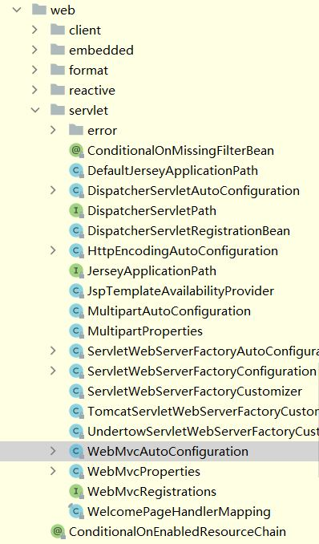
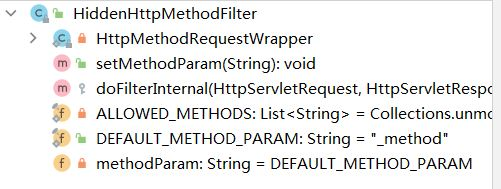
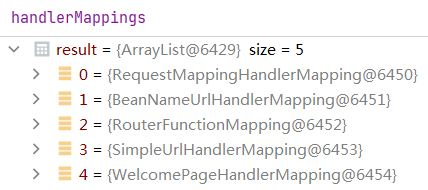
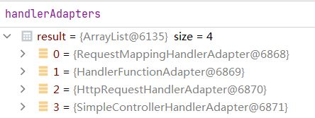
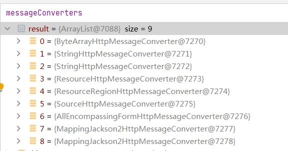

### 自动配置原理
#### 分析

自动配置主入口： @SpringBootApplication

除去原注解的定义如下
```java
@SpringBootConfiguration
@EnableAutoConfiguration
@ComponentScan(excludeFilters = { @Filter(type = FilterType.CUSTOM, classes = TypeExcludeFilter.class),
		@Filter(type = FilterType.CUSTOM, classes = AutoConfigurationExcludeFilter.class) })
public @interface SpringBootApplication {}
```
- SpringBootConfiguration中有一个ProxyBeanMethods参数来指定bean之间是否相互引用

- ComponentScan指定扫描哪些包和不扫描哪些包,添加两个排除的过滤器
- EnableAutoConfiguration
```java
@AutoConfigurationPackage
@Import(AutoConfigurationImportSelector.class)
public @interface EnableAutoConfiguration {}

-----------------------------AutoConfigurationImportSelector-------------------------------------------
List<String> configurations = getCandidateConfigurations(annotationMetadata, attributes);
-------------------------------------------------------------------------------------------------------
protected List<String> getCandidateConfigurations(AnnotationMetadata metadata, AnnotationAttributes attributes) {
		List<String> configurations = SpringFactoriesLoader.loadFactoryNames(getSpringFactoriesLoaderFactoryClass(),
				getBeanClassLoader());
		Assert.notEmpty(configurations, "No auto configuration classes found in META-INF/spring.factories. If you "
				+ "are using a custom packaging, make sure that file is correct.");
		return configurations;
	}
----------------------------------------------------------------------------------------------------------------

return loadSpringFactories(classLoaderToUse).getOrDefault(factoryTypeName, Collections.emptyList());
factoryTypeName = org.springframework.boot.autoconfigure.EnableAutoConfiguration
----------------------------------------------------------------------------------------------------------------
Enumeration<URL> urls = classLoader.getResources(FACTORIES_RESOURCE_LOCATION);
META-INF/spring.factories
默认扫描当前系统中所有这个文件

比较核心的是Spring-boot-autoconfig这个包里

# Auto Configure
org.springframework.boot.autoconfigure.EnableAutoConfiguration=\
org.springframework.boot.autoconfigure.admin.SpringApplicationAdminJmxAutoConfiguration,\
org.springframework.boot.autoconfigure.aop.AopAutoConfiguration,\
......

名字对上了！

虽然127个配置类会自动加载，但是最后会按需生效

```


- AutoConfigurationPackage
```java
@Import(AutoConfigurationPackages.Registrar.class)
public @interface AutoConfigurationPackage {}

register(registry, new PackageImports(metadata).getPackageNames().toArray(new String[0]));

new PackageImports(metadata).getPackageNames().toArray(new String[0])： 的到metadata也就是注解的信息，然后解析出来类的位置，然后生成导入包
```
作用是注册，application所在包下的所有组件

### 观察DispatcherServletAutoConfiguration
```java
@AutoConfigureOrder(Ordered.HIGHEST_PRECEDENCE)//配置顺序
@Configuration(proxyBeanMethods = false)//是否依赖
@ConditionalOnWebApplication(type = Type.SERVLET)//只有在servlet模式下
@ConditionalOnClass(DispatcherServlet.class)
@AutoConfigureAfter(ServletWebServerFactoryAutoConfiguration.class)
public class DispatcherServletAutoConfiguration {}
```


### SpringBootWeb

```java
----------------------------------------WebMvcAutoConfiguration---------------------------------------------------------
@Configuration(proxyBeanMethods = false)
@ConditionalOnWebApplication(type = Type.SERVLET)
@ConditionalOnClass({ Servlet.class, DispatcherServlet.class, WebMvcConfigurer.class })
@ConditionalOnMissingBean(WebMvcConfigurationSupport.class)//全面接管mvc配置
@AutoConfigureOrder(Ordered.HIGHEST_PRECEDENCE + 10)
@AutoConfigureAfter({ DispatcherServletAutoConfiguration.class, TaskExecutionAutoConfiguration.class,
		ValidationAutoConfiguration.class })
public class WebMvcAutoConfiguration {}
----------------------------------------WebMvcAutoConfigurationAdapter---------------------------------------------------------
	内部类一个
	@Configuration(proxyBeanMethods = false)
	@Import(EnableWebMvcConfiguration.class)
	//								spring.mvc 					spring.web
	@EnableConfigurationProperties({ WebMvcProperties.class, WebProperties.class })//两个数据类
	@Order(0)
	public static class WebMvcAutoConfigurationAdapter implements WebMvcConfigurer, ServletContextAware {}
----------------------------------------------Constructor----------------------------------------------------------------------------
		public WebMvcAutoConfigurationAdapter(	WebProperties webProperties,
												WebMvcProperties mvcProperties,
												ListableBeanFactory beanFactory,//bean容器
												ObjectProvider<HttpMessageConverters> messageConvertersProvider,
												ObjectProvider<ResourceHandlerRegistrationCustomizer> resourceHandlerRegistrationCustomizerProvider,
												//资源处理器的自定义器
												ObjectProvider<DispatcherServletPath> dispatcherServletPath,//路径
												ObjectProvider<ServletRegistrationBean<?>> servletRegistrations//给应用注册Servlet，Filter，Listener之类
												) {
			this.resourceProperties = webProperties.getResources();
			this.mvcProperties = mvcProperties;
			this.beanFactory = beanFactory;
			this.messageConvertersProvider = messageConvertersProvider;
			this.resourceHandlerRegistrationCustomizer = resourceHandlerRegistrationCustomizerProvider.getIfAvailable();
			this.dispatcherServletPath = dispatcherServletPath;
			this.servletRegistrations = servletRegistrations;
			this.mvcProperties.checkConfiguration();
		}
----------------------------------------------配置静态资源访问路径---------------------------------------------------------------------
----------------------------------------------addResourceHandlers----------------------------------------------------------------------
		public void addResourceHandlers(ResourceHandlerRegistry registry) {
			if (!this.resourceProperties.isAddMappings()) {
				logger.debug("Default resource handling disabled");
				return;
			}
			addResourceHandler(registry, "/webjars/**", "classpath:/META-INF/resources/webjars/");
			addResourceHandler(registry, this.mvcProperties.getStaticPathPattern(), (registration) -> {
				registration.addResourceLocations(this.resourceProperties.getStaticLocations());
				if (this.servletContext != null) {
					ServletContextResource resource = new ServletContextResource(this.servletContext, SERVLET_LOCATION);
					registration.addResourceLocations(resource);
				}
			});
		}

-----------------------------------------------配置欢迎页---------------------------------------------------------------------------
welcomePageHandlerMapping();
```

#### Rest请求参数处理
```java
public class HiddenHttpMethodFilter extends OncePerRequestFilter
```
    
自己写一个配置类并且放一个HiddenHttpMethodFilter到容器里面就可以了

#### 请求映射原理
```java
protected void doDispatch(HttpServletRequest request, HttpServletResponse response) throws Exception {
		HttpServletRequest processedRequest = request;
		HandlerExecutionChain mappedHandler = null;
		boolean multipartRequestParsed = false;

		WebAsyncManager asyncManager = WebAsyncUtils.getAsyncManager(request);

		try {
			ModelAndView mv = null;
			Exception dispatchException = null;

			try {
				processedRequest = checkMultipart(request);
				multipartRequestParsed = (processedRequest != request);

				// Determine handler for the current request.
				mappedHandler = getHandler(processedRequest);
				if (mappedHandler == null) {
					noHandlerFound(processedRequest, response);
					return;
				}
```


- 第一步通过handlerMappings获得mappedHandler
```
				// Determine handler adapter for the current request.
				HandlerAdapter ha = getHandlerAdapter(mappedHandler.getHandler());
```


- 第二不通过handlerAdapters来获得 handlerAdapter
```
				// Process last-modified header, if supported by the handler.
				String method = request.getMethod();
				boolean isGet = HttpMethod.GET.matches(method);
				if (isGet || HttpMethod.HEAD.matches(method)) {
					long lastModified = ha.getLastModified(request, mappedHandler.getHandler());
					if (new ServletWebRequest(request, response).checkNotModified(lastModified) && isGet) {
						return;
					}
				}
```

- 来判断是不是head ，head不需要服务器的处理
```

				if (!mappedHandler.applyPreHandle(processedRequest, response)) {
					return;
				}

				// Actually invoke the handler.
				mv = ha.handle(processedRequest, response, mappedHandler.getHandler());
```
执行目标方法，返回ModelAndView,进入分支
```java
------------------------------------------------------ha.handle，进入方法的执行-----------------------------------------------------------------------------

				protected ModelAndView handleInternal(HttpServletRequest request,
							HttpServletResponse response, HandlerMethod handlerMethod) throws Exception {

						ModelAndView mav;
						checkRequest(request);

						// Execute invokeHandlerMethod in synchronized block if required.
						if (this.synchronizeOnSession) {
							HttpSession session = request.getSession(false);
							if (session != null) {
								Object mutex = WebUtils.getSessionMutex(session);
								synchronized (mutex) {
									mav = invokeHandlerMethod(request, response, handlerMethod);
								}
							}
							else {
								// No HttpSession available -> no mutex necessary
								mav = invokeHandlerMethod(request, response, handlerMethod);
							}
						}
						else {
							// No synchronization on session demanded at all...
							mav = invokeHandlerMethod(request, response, handlerMethod);
						}

						if (!response.containsHeader(HEADER_CACHE_CONTROL)) {
							if (getSessionAttributesHandler(handlerMethod).hasSessionAttributes()) {
								applyCacheSeconds(response, this.cacheSecondsForSessionAttributeHandlers);
							}
							else {
								prepareResponse(response);
							}
						}

						return mav;
					}
-------------------------------------------------------invokeHandlerMethod-------------------------------------------------------------------
				protected ModelAndView invokeHandlerMethod(HttpServletRequest request,
							HttpServletResponse response, HandlerMethod handlerMethod) throws Exception {

						ServletWebRequest webRequest = new ServletWebRequest(request, response);
						try {
							WebDataBinderFactory binderFactory = getDataBinderFactory(handlerMethod);
							ModelFactory modelFactory = getModelFactory(handlerMethod, binderFactory);

							ServletInvocableHandlerMethod invocableMethod = createInvocableHandlerMethod(handlerMethod);
							if (this.argumentResolvers != null) {

							*********************获取参数解析器*************************************************
								invocableMethod.setHandlerMethodArgumentResolvers(this.argumentResolvers);
								//可以参数地方可以获取多少种参数
							***********************************************************************************
							}
							if (this.returnValueHandlers != null) {
							**********************返回参数解析器************************************************
								invocableMethod.setHandlerMethodReturnValueHandlers(this.returnValueHandlers);
								//可以处理多少返回值处理器
							**********************************************************************************
							}
							invocableMethod.setDataBinderFactory(binderFactory);
							invocableMethod.setParameterNameDiscoverer(this.parameterNameDiscoverer);

							ModelAndViewContainer mavContainer = new ModelAndViewContainer();
							mavContainer.addAllAttributes(RequestContextUtils.getInputFlashMap(request));
							modelFactory.initModel(webRequest, mavContainer, invocableMethod);
							mavContainer.setIgnoreDefaultModelOnRedirect(this.ignoreDefaultModelOnRedirect);

							AsyncWebRequest asyncWebRequest = WebAsyncUtils.createAsyncWebRequest(request, response);
							asyncWebRequest.setTimeout(this.asyncRequestTimeout);

							WebAsyncManager asyncManager = WebAsyncUtils.getAsyncManager(request);
							asyncManager.setTaskExecutor(this.taskExecutor);
							asyncManager.setAsyncWebRequest(asyncWebRequest);
							asyncManager.registerCallableInterceptors(this.callableInterceptors);
							asyncManager.registerDeferredResultInterceptors(this.deferredResultInterceptors);

							if (asyncManager.hasConcurrentResult()) {
								Object result = asyncManager.getConcurrentResult();
								mavContainer = (ModelAndViewContainer) asyncManager.getConcurrentResultContext()[0];
								asyncManager.clearConcurrentResult();
								LogFormatUtils.traceDebug(logger, traceOn -> {
									String formatted = LogFormatUtils.formatValue(result, !traceOn);
									return "Resume with async result [" + formatted + "]";
								});
								invocableMethod = invocableMethod.wrapConcurrentResult(result);
							}
```
以上都是初始化操作
```
							invocableMethod.invokeAndHandle(webRequest, mavContainer);
```
真正调用函数, 进入分支二
```java
			//遍历resolver判断是否支持这个类型的参数
			if (!this.resolvers.supportsParameter(parameter)) {
				throw new IllegalStateException(formatArgumentError(parameter, "No suitable resolver"));
			}
			try {
				//遍历resolver并且进行解析参数
				args[i] = this.resolvers.resolveArgument(parameter, mavContainer, request, this.dataBinderFactory);
			}

----------------------------------------------------ResolveArgument-----------------------------------------------------------------------------
这里全是参数解析
还可以解析servlet原生api，看ServletRequestMethodArgumentResolver 就好了
1.2、Servlet API：
WebRequest、ServletRequest、MultipartRequest、 HttpSession、javax.servlet.http.PushBuilder、Principal、InputStream、Reader、HttpMethod、Locale、TimeZone、ZoneId

如果是普通参数就直接从request域中取，
如果是model或者map就从mavContainer中获取
在mavContainer中有一个字段，在初始化的时候就 new 了一个BindingAwareModelMap() 

public final Object resolveArgument(MethodParameter parameter, @Nullable ModelAndViewContainer mavContainer,
			NativeWebRequest webRequest, @Nullable WebDataBinderFactory binderFactory) throws Exception {

		NamedValueInfo namedValueInfo = getNamedValueInfo(parameter);
		MethodParameter nestedParameter = parameter.nestedIfOptional();

		//Resolve the given annotation-specified value, potentially containing placeholders and expressions.
		Object resolvedName = resolveEmbeddedValuesAndExpressions(namedValueInfo.name);
		if (resolvedName == null) {
			throw new IllegalArgumentException(
					"Specified name must not resolve to null: [" + namedValueInfo.name + "]");
		}

		//Resolve the given parameter type and value name into an argument value.
		Object arg = resolveName(resolvedName.toString(), nestedParameter, webRequest);
		if (arg == null) {
			if (namedValueInfo.defaultValue != null) {
				arg = resolveEmbeddedValuesAndExpressions(namedValueInfo.defaultValue);
			}
			else if (namedValueInfo.required && !nestedParameter.isOptional()) {
				handleMissingValue(namedValueInfo.name, nestedParameter, webRequest);
			}
			arg = handleNullValue(namedValueInfo.name, arg, nestedParameter.getNestedParameterType());
		}
		else if ("".equals(arg) && namedValueInfo.defaultValue != null) {
			arg = resolveEmbeddedValuesAndExpressions(namedValueInfo.defaultValue);
		}

		//如果传入的binderFactory不为空 ，也就是model工厂
		if (binderFactory != null) {
			//利用model工厂创建一个binder
			WebDataBinder binder = binderFactory.createBinder(webRequest, null, namedValueInfo.name);
			try {
				arg = binder.convertIfNecessary(arg, parameter.getParameterType(), parameter);
			}
			catch (ConversionNotSupportedException ex) {
				throw new MethodArgumentConversionNotSupportedException(arg, ex.getRequiredType(),
						namedValueInfo.name, parameter, ex.getCause());
			}
			catch (TypeMismatchException ex) {
				throw new MethodArgumentTypeMismatchException(arg, ex.getRequiredType(),
						namedValueInfo.name, parameter, ex.getCause());
			}
			// Check for null value after conversion of incoming argument value
			if (arg == null && namedValueInfo.defaultValue == null &&
					namedValueInfo.required && !nestedParameter.isOptional()) {
				handleMissingValueAfterConversion(namedValueInfo.name, nestedParameter, webRequest);
			}
		}

		handleResolvedValue(arg, namedValueInfo.name, parameter, mavContainer, webRequest);

		return arg;
	}
```

出分支二，已经执行完方法，开始处理返回参数

通过mavContainer或获得执行过程中保存的参数
```java
---------------------获取返回值处理器
就是处理了一下setviewname

public void handleReturnValue(@Nullable Object returnValue, MethodParameter returnType,
			ModelAndViewContainer mavContainer, NativeWebRequest webRequest) throws Exception {

		//获得返回值处理器
		HandlerMethodReturnValueHandler handler = selectHandler(returnValue, returnType);
		--------------------------------------
									private HandlerMethodReturnValueHandler selectHandler(@Nullable Object value, MethodParameter returnType) {
												boolean isAsyncValue = isAsyncReturnValue(value, returnType);
												for (HandlerMethodReturnValueHandler handler : this.returnValueHandlers) {
													if (isAsyncValue && !(handler instanceof AsyncHandlerMethodReturnValueHandler)) {
														continue;
													}
													if (handler.supportsReturnType(returnType)) {
														return handler;
													}
												}
										return null;
									}
		--------------------------------------
		if (handler == null) {
			throw new IllegalArgumentException("Unknown return value type: " + returnType.getParameterType().getName());
		}
		//处理返回值
		handler.handleReturnValue(returnValue, returnType, mavContainer, webRequest);
	}
```

返回所有分之继续执行
```java
							if (asyncManager.isConcurrentHandlingStarted()) {
								return null;
							}

							return getModelAndView(mavContainer, modelFactory, webRequest);
							------------------------------------------------------------------
											private ModelAndView getModelAndView(ModelAndViewContainer mavContainer,
													ModelFactory modelFactory, NativeWebRequest webRequest) throws Exception {


												//TODO
												modelFactory.updateModel(webRequest, mavContainer);
												if (mavContainer.isRequestHandled()) {
													return null;
												}
												ModelMap model = mavContainer.getModel();
												//将model数据封装成modelandview
												ModelAndView mav = new ModelAndView(mavContainer.getViewName(), model, mavContainer.getStatus());
												if (!mavContainer.isViewReference()) {
													mav.setView((View) mavContainer.getView());
												}
												//如果你是重定向数据就拿来放在请求的上下文里面 也就是session中。
												if (model instanceof RedirectAttributes) {
													Map<String, ?> flashAttributes = ((RedirectAttributes) model).getFlashAttributes();
													HttpServletRequest request = webRequest.getNativeRequest(HttpServletRequest.class);
													if (request != null) {
														RequestContextUtils.getOutputFlashMap(request).putAll(flashAttributes);
													}
												}
												return mav;
											}
							------------------------------------------------------------------
						}
						finally {
							webRequest.requestCompleted();
						}
					}
```


方法执行完成，的到modelandview回到dodispatch里面继续执行
```java
				if (asyncManager.isConcurrentHandlingStarted()) {
					return;
				}

				----------//执行拦截器的地方
				applyDefaultViewName(processedRequest, mv);
				mappedHandler.applyPostHandle(processedRequest, response, mv);
			}
			catch (Exception ex) {
				dispatchException = ex;
			}
			catch (Throwable err) {
				// As of 4.3, we're processing Errors thrown from handler methods as well,
				// making them available for @ExceptionHandler methods and other scenarios.
				dispatchException = new NestedServletException("Handler dispatch failed", err);
			}
			----------------------------------------关键点，处理派发结果
			processDispatchResult(processedRequest, response, mappedHandler, mv, dispatchException);
			----------------------------------------------------------------------------------------
												private void processDispatchResult(HttpServletRequest request, HttpServletResponse response,
												@Nullable HandlerExecutionChain mappedHandler, @Nullable ModelAndView mv,
												@Nullable Exception exception) throws Exception {

											boolean errorView = false;

											if (exception != null) {
												if (exception instanceof ModelAndViewDefiningException) {
													logger.debug("ModelAndViewDefiningException encountered", exception);
													mv = ((ModelAndViewDefiningException) exception).getModelAndView();
												}
												else {
													Object handler = (mappedHandler != null ? mappedHandler.getHandler() : null);
													mv = processHandlerException(request, response, handler, exception);
													errorView = (mv != null);
												}
											}

											// Did the handler return a view to render?
											if (mv != null && !mv.wasCleared()) {

												***************很重要的渲染
												render(mv, request, response);
												-------------------------------------------------------------------------------
																				protected void render(ModelAndView mv, HttpServletRequest request, HttpServletResponse response) throws Exception {
																				// Determine locale for request and apply it to the response.
																				Locale locale =
																						(this.localeResolver != null ? this.localeResolver.resolveLocale(request) : request.getLocale());
																				response.setLocale(locale);

																				View view;
																				String viewName = mv.getViewName();
																				if (viewName != null) {

																					// We need to resolve the view name.
																					//使用viewResolver来解析生成view名字
																					view = resolveViewName(viewName, mv.getModelInternal(), locale, request);
																					if (view == null) {
																						throw new ServletException("Could not resolve view with name '" + mv.getViewName() +
																								"' in servlet with name '" + getServletName() + "'");
																					}
																				}
																				else {
																					// No need to lookup: the ModelAndView object contains the actual View object.
																					view = mv.getView();
																					if (view == null) {
																						throw new ServletException("ModelAndView [" + mv + "] neither contains a view name nor a " +
																								"View object in servlet with name '" + getServletName() + "'");
																					}
																				}

																				// Delegate to the View object for rendering.
																				if (logger.isTraceEnabled()) {
																					logger.trace("Rendering view [" + view + "] ");
																				}
																				try {
																					if (mv.getStatus() != null) {
																						request.setAttribute(View.RESPONSE_STATUS_ATTRIBUTE, mv.getStatus());
																						response.setStatus(mv.getStatus().value());
																					}


				-----------------------------------------------------------------------------------------------------真正开始渲染
																					view.render(mv.getModelInternal(), request, response);


																	---------------------------------------------------
																		public void render(@Nullable Map<String, ?> model, HttpServletRequest request,
																					HttpServletResponse response) throws Exception {

																				if (logger.isDebugEnabled()) {
																					logger.debug("View " + formatViewName() +
																							", model " + (model != null ? model : Collections.emptyMap()) +
																							(this.staticAttributes.isEmpty() ? "" : ", static attributes " + this.staticAttributes));
																				}

																				Map<String, Object> mergedModel = createMergedOutputModel(model, request, response);
																				prepareResponse(request, response);
																				renderMergedOutputModel(mergedModel, getRequestToExpose(request), response);
																			}
																------------------------------------------------------
																			

---------------------------------------------------------------------------------renderMergedOutputModel----------------------------------------
protected void renderMergedOutputModel(
			Map<String, Object> model, HttpServletRequest request, HttpServletResponse response) throws Exception {

		// Expose the model object as request attributes.
		exposeModelAsRequestAttributes(model, request);

		// Expose helpers as request attributes, if any.
		exposeHelpers(request);

		// Determine the path for the request dispatcher.
		String dispatcherPath = prepareForRendering(request, response);

		// Obtain a RequestDispatcher for the target resource (typically a JSP).
		RequestDispatcher rd = getRequestDispatcher(request, dispatcherPath);
		if (rd == null) {
			throw new ServletException("Could not get RequestDispatcher for [" + getUrl() +
					"]: Check that the corresponding file exists within your web application archive!");
		}

		// If already included or response already committed, perform include, else forward.
		if (useInclude(request, response)) {
			response.setContentType(getContentType());
			if (logger.isDebugEnabled()) {
				logger.debug("Including [" + getUrl() + "]");
			}
			rd.include(request, response);
		}

		else {
			// Note: The forwarded resource is supposed to determine the content type itself.
			if (logger.isDebugEnabled()) {
				logger.debug("Forwarding to [" + getUrl() + "]");
			}
			rd.forward(request, response);
		}
	}
	------------------------------------------------------------------------------------------------------------------------


																				}
																				catch (Exception ex) {
																					if (logger.isDebugEnabled()) {
																						logger.debug("Error rendering view [" + view + "]", ex);
																					}
																					throw ex;
																				}
																			}
												-------------------------------------------------------------------------------
												if (errorView) {
													WebUtils.clearErrorRequestAttributes(request);
												}
											}
											else {
												if (logger.isTraceEnabled()) {
													logger.trace("No view rendering, null ModelAndView returned.");
												}
											}

											if (WebAsyncUtils.getAsyncManager(request).isConcurrentHandlingStarted()) {
												// Concurrent handling started during a forward
												return;
											}

											if (mappedHandler != null) {
												// Exception (if any) is already handled..
												mappedHandler.triggerAfterCompletion(request, response, null);
											}
										}
			-----------------------------------------------------------------------------------------
		}
		catch (Exception ex) {
			triggerAfterCompletion(processedRequest, response, mappedHandler, ex);
		}
		catch (Throwable err) {
			triggerAfterCompletion(processedRequest, response, mappedHandler,
					new NestedServletException("Handler processing failed", err));
		}
		finally {
			if (asyncManager.isConcurrentHandlingStarted()) {
				// Instead of postHandle and afterCompletion
				if (mappedHandler != null) {
					mappedHandler.applyAfterConcurrentHandlingStarted(processedRequest, response);
				}
			}
			else {
				// Clean up any resources used by a multipart request.
				if (multipartRequestParsed) {
					cleanupMultipart(processedRequest);
				}
			}
		}
	}
```

### pojo的封装过程
选择servletModelAttribute解析器解析
```java
public final Object resolveArgument(MethodParameter parameter, @Nullable ModelAndViewContainer mavContainer,
			NativeWebRequest webRequest, @Nullable WebDataBinderFactory binderFactory) throws Exception {

		Assert.state(mavContainer != null, "ModelAttributeMethodProcessor requires ModelAndViewContainer");
		Assert.state(binderFactory != null, "ModelAttributeMethodProcessor requires WebDataBinderFactory");

		String name = ModelFactory.getNameForParameter(parameter);
		ModelAttribute ann = parameter.getParameterAnnotation(ModelAttribute.class);
		if (ann != null) {
			mavContainer.setBinding(name, ann.binding());
		}

		Object attribute = null;
		BindingResult bindingResult = null;

		if (mavContainer.containsAttribute(name)) {
			attribute = mavContainer.getModel().get(name);
		}
		else {
			// Create attribute instance
			try {
				attribute = createAttribute(name, parameter, binderFactory, webRequest);
			}
			catch (BindException ex) {
				if (isBindExceptionRequired(parameter)) {
					// No BindingResult parameter -> fail with BindException
					throw ex;
				}
				// Otherwise, expose null/empty value and associated BindingResult
				if (parameter.getParameterType() == Optional.class) {
					attribute = Optional.empty();
				}
				else {
					attribute = ex.getTarget();
				}
				bindingResult = ex.getBindingResult();
			}
		}

		if (bindingResult == null) {
			// Bean property binding and validation;
			// skipped in case of binding failure on construction.
----------------WebDataBinder binder = binderFactory.createBinder(webRequest, attribute, name);
//转换器就在binder里面

			if (binder.getTarget() != null) {
				if (!mavContainer.isBindingDisabled(name)) {
					bindRequestParameters(binder, webRequest);
				}
				validateIfApplicable(binder, parameter);
				if (binder.getBindingResult().hasErrors() && isBindExceptionRequired(binder, parameter)) {
					throw new BindException(binder.getBindingResult());
				}
			}
			// Value type adaptation, also covering java.util.Optional
			if (!parameter.getParameterType().isInstance(attribute)) {
				attribute = binder.convertIfNecessary(binder.getTarget(), parameter.getParameterType(), parameter);
			}
			bindingResult = binder.getBindingResult();
		}

		// Add resolved attribute and BindingResult at the end of the model
		Map<String, Object> bindingResultModel = bindingResult.getModel();
		mavContainer.removeAttributes(bindingResultModel);
		mavContainer.addAllAttributes(bindingResultModel);

		return attribute;
	}

```


### 返回值处理与内容协商
开始还是按照以前一样找到一个可以处理的resolver，然后调用他的handleRetruenValue方法
```java
		HandlerMethodReturnValueHandler handler = selectHandler(returnValue, returnType);
		if (handler == null) {
			throw new IllegalArgumentException("Unknown return value type: " + returnType.getParameterType().getName());
		}
		handler.handleReturnValue(returnValue, returnType, mavContainer, webRequest);
```
最后一步执行函数
```java
		public void handleReturnValue(@Nullable Object returnValue, MethodParameter returnType,
					ModelAndViewContainer mavContainer, NativeWebRequest webRequest)
					throws IOException, HttpMediaTypeNotAcceptableException, HttpMessageNotWritableException {

				mavContainer.setRequestHandled(true);
				ServletServerHttpRequest inputMessage = createInputMessage(webRequest);
				ServletServerHttpResponse outputMessage = createOutputMessage(webRequest);

				// Try even with null return value. ResponseBodyAdvice could get involved.
				writeWithMessageConverters(returnValue, returnType, inputMessage, outputMessage);
		}
```

- 上面有一个很重要的内容httpMessageConverters
- 

以下是内容协商的主要内容
```java
protected <T> void writeWithMessageConverters(@Nullable T value, MethodParameter returnType,
			ServletServerHttpRequest inputMessage, ServletServerHttpResponse outputMessage)
			throws IOException, HttpMediaTypeNotAcceptableException, HttpMessageNotWritableException {

		Object body;
		Class<?> valueType;
		Type targetType;

		if (value instanceof CharSequence) {
			body = value.toString();
			valueType = String.class;
			targetType = String.class;
		}
		else {
			body = value;
			valueType = getReturnValueType(body, returnType);
			targetType = GenericTypeResolver.resolveType(getGenericType(returnType), returnType.getContainingClass());
		}

//处理流数据的办法
		if (isResourceType(value, returnType)) {
			outputMessage.getHeaders().set(HttpHeaders.ACCEPT_RANGES, "bytes");
			if (value != null && inputMessage.getHeaders().getFirst(HttpHeaders.RANGE) != null &&
					outputMessage.getServletResponse().getStatus() == 200) {
				Resource resource = (Resource) value;
				try {
					List<HttpRange> httpRanges = inputMessage.getHeaders().getRange();
					outputMessage.getServletResponse().setStatus(HttpStatus.PARTIAL_CONTENT.value());
					body = HttpRange.toResourceRegions(httpRanges, resource);
					valueType = body.getClass();
					targetType = RESOURCE_REGION_LIST_TYPE;
				}
				catch (IllegalArgumentException ex) {
					outputMessage.getHeaders().set(HttpHeaders.CONTENT_RANGE, "bytes */" + resource.contentLength());
					outputMessage.getServletResponse().setStatus(HttpStatus.REQUESTED_RANGE_NOT_SATISFIABLE.value());
				}
			}
		}

//内容协商内容
		//首先获得响应头的mediatype，也就是以前设置了就不用设置了
		MediaType selectedMediaType = null;
		MediaType contentType = outputMessage.getHeaders().getContentType();
		boolean isContentTypePreset = contentType != null && contentType.isConcrete();
		if (isContentTypePreset) {
			if (logger.isDebugEnabled()) {
				logger.debug("Found 'Content-Type:" + contentType + "' in response");
			}
			selectedMediaType = contentType;
		}
		else {
			//开始内容协商
			HttpServletRequest request = inputMessage.getServletRequest();
			List<MediaType> acceptableTypes;
			try {
				acceptableTypes = getAcceptableMediaTypes(request);
			}
			//以上获取可以接收到额mediaType
			catch (HttpMediaTypeNotAcceptableException ex) {
				int series = outputMessage.getServletResponse().getStatus() / 100;
				if (body == null || series == 4 || series == 5) {
					if (logger.isDebugEnabled()) {
						logger.debug("Ignoring error response content (if any). " + ex);
					}
					return;
				}
				throw ex;
			}
			//生成可以生成的的meidatype
			List<MediaType> producibleTypes = getProducibleMediaTypes(request, valueType, targetType);

			if (body != null && producibleTypes.isEmpty()) {
				throw new HttpMessageNotWritableException(
						"No converter found for return value of type: " + valueType);
			}

			//生成可以使用的mediaTYpes
			List<MediaType> mediaTypesToUse = new ArrayList<>();
			for (MediaType requestedType : acceptableTypes) {
				for (MediaType producibleType : producibleTypes) {
					if (requestedType.isCompatibleWith(producibleType)) {
						mediaTypesToUse.add(getMostSpecificMediaType(requestedType, producibleType));
					}
				}
			}
			if (mediaTypesToUse.isEmpty()) {
				if (body != null) {
					throw new HttpMediaTypeNotAcceptableException(producibleTypes);
				}
				if (logger.isDebugEnabled()) {
					logger.debug("No match for " + acceptableTypes + ", supported: " + producibleTypes);
				}
				return;
			}

			//按照优先级排个序
			MediaType.sortBySpecificityAndQuality(mediaTypesToUse);

			for (MediaType mediaType : mediaTypesToUse) {
				if (mediaType.isConcrete()) {
					selectedMediaType = mediaType;
					break;
				}
				else if (mediaType.isPresentIn(ALL_APPLICATION_MEDIA_TYPES)) {
					selectedMediaType = MediaType.APPLICATION_OCTET_STREAM;
					break;
				}
			}

			if (logger.isDebugEnabled()) {
				logger.debug("Using '" + selectedMediaType + "', given " +
						acceptableTypes + " and supported " + producibleTypes);
			}
		}


		//
		if (selectedMediaType != null) {
			selectedMediaType = selectedMediaType.removeQualityValue();
			for (HttpMessageConverter<?> converter : this.messageConverters) {
				GenericHttpMessageConverter genericConverter = (converter instanceof GenericHttpMessageConverter ?
						(GenericHttpMessageConverter<?>) converter : null);
				if (genericConverter != null ?
						((GenericHttpMessageConverter) converter).canWrite(targetType, valueType, selectedMediaType) :
						converter.canWrite(valueType, selectedMediaType)) {
					body = getAdvice().beforeBodyWrite(body, returnType, selectedMediaType,
							(Class<? extends HttpMessageConverter<?>>) converter.getClass(),
							inputMessage, outputMessage);
					if (body != null) {
						Object theBody = body;
						LogFormatUtils.traceDebug(logger, traceOn ->
								"Writing [" + LogFormatUtils.formatValue(theBody, !traceOn) + "]");
						addContentDispositionHeader(inputMessage, outputMessage);
						if (genericConverter != null) {
							genericConverter.write(body, targetType, selectedMediaType, outputMessage);
						}
						else {
							((HttpMessageConverter) converter).write(body, selectedMediaType, outputMessage);
						}
					}
					else {
						if (logger.isDebugEnabled()) {
							logger.debug("Nothing to write: null body");
						}
					}
					return;
				}
			}
		}

		if (body != null) {
			Set<MediaType> producibleMediaTypes =
					(Set<MediaType>) inputMessage.getServletRequest()
							.getAttribute(HandlerMapping.PRODUCIBLE_MEDIA_TYPES_ATTRIBUTE);

			if (isContentTypePreset || !CollectionUtils.isEmpty(producibleMediaTypes)) {
				throw new HttpMessageNotWritableException(
						"No converter for [" + valueType + "] with preset Content-Type '" + contentType + "'");
			}
			throw new HttpMediaTypeNotAcceptableException(getSupportedMediaTypes(body.getClass()));
		}
	}

```

可以开启基于参数的内容协商

自己写MessageConverter
```java
public class MyConverter implements HttpMessageConverter<Person> {
	方法实现
}
```

自己配置configureContentNegotiation,注意这里和默认配置是相互排斥的
```java
 			@Override
            public void configureContentNegotiation(ContentNegotiationConfigurer configurer) {
                Map<String, MediaType> mediaTypes = new HashMap<>();
                mediaTypes.put("json",MediaType.APPLICATION_JSON);
                mediaTypes.put("xml",MediaType.APPLICATION_XML);
                mediaTypes.put("guo",MediaType.parseMediaType("application/x-guo"));
                ParameterContentNegotiationStrategy parameterContentNegotiationStrategy = new ParameterContentNegotiationStrategy(mediaTypes);
                configurer.strategies(Arrays.asList(parameterContentNegotiationStrategy));
            }
```


#### 视图解析与模板引擎

主要用来搭建后台的管理系统，其他的时候都是直接前后端分离的


#### 异常处理

#### Web原生组件注入（Servlet、Filter、Listener）
1、使用Servlet API  
@ServletComponentScan(basePackages = "com.atguigu.admin") :指定原生Servlet组件都放在那里  
@WebServlet(urlPatterns = "/my")：效果：直接响应，没有经过Spring的拦截器？  
@WebFilter(urlPatterns={"/css/*","/images/*"})  
@WebListener  

Tomcat-Servlet；
多个Servlet都能处理到同一层路径，精确优选原则
A： /my/
B： /my/1


#### 嵌入式Servlet容器，就是服务器
● 原理
  ○ SpringBoot应用启动发现当前是Web应用。web场景包-导入tomcat
  ○ web应用会创建一个web版的ioc容器 ServletWebServerApplicationContext 
  ○ ServletWebServerApplicationContext  启动的时候寻找 ServletWebServerFactory（Servlet 的web服务器工厂---> Servlet 的web服务器）  
  ○ SpringBoot底层默认有很多的WebServer工厂；TomcatServletWebServerFactory, JettyServletWebServerFactory, or UndertowServletWebServerFactory
  ○ 底层直接会有一个自动配置类。ServletWebServerFactoryAutoConfiguration
  ○ ServletWebServerFactoryAutoConfiguration导入了ServletWebServerFactoryConfiguration（配置类）
  ○ ServletWebServerFactoryConfiguration 配置类 根据动态判断系统中到底导入了那个Web服务器的包。（默认是web-starter导入tomcat包），容器中就有 TomcatServletWebServerFactory
  ○ TomcatServletWebServerFactory 创建出Tomcat服务器并启动；TomcatWebServer 的构造器拥有初始化方法initialize---this.tomcat.start();
  ○ 内嵌服务器，就是手动把启动服务器的代码调用（tomcat核心jar包存在）


#### 定制化原理
- @Bean替换，增加容器中的默认组件，视图解析器
- 修改配置文件
- xxxxxCustomizer
- 编写自定义的配置类xxxxConfiguration
- web应用是吸纳WebMvcConfiguration
- @EnableWebMvc+WebMvcConfigurer 可以全面接管springmvc


#### 数据访问
1. 导入starter   
2. 导入数据库驱动   

- DataSourceAutoConfiguration自动数据源配置
- DataSourceTransactionManagerAutoConfiguration 事务的配置
- JdbcTemplateAutoConfiguration spring自带jdbc工具配置
- JndiDataSourceAutoConfiguration
- XADataSourceAutoConfiguration 分布式事务配置