#### 01 概述
1. 单个表可存储数据量很大 几万几亿 与 文件 差别很大    
2. DB / DBMS Database Management System/ SQL  
  
#### sql 语言规范
与关键字冲突的名字要用飘号引起来  

数据导入: source + 文件地址   
  
#### select
  
目录  
1. 列的别名： as ，双引号，命名规范之类  
2. 去除重复行 ： 有关distinct的用法  
3. 空值参与运算：运算的结果都是空，空值的特殊性null  
4. 着重号：也就是飘号用来区分名字的  
5. 查询常数： select里的小功能  
6. 显示表结构：desc  
7. 过滤数据：where   
  
一般情况下，除非需要使用表中所有的字段数据，最好不要使用通配符‘\*’。使用通配符虽然可以节  
省输入查询语句的时间，但是获取不需要的列数据通常会降低查询和所使用的应用程序的效率。通  
配符的优势是，当不知道所需要的列的名称时，可以通过它获取它们。  
在生产环境下，不推荐你直接使用SELECT \*进行查询。  
  
  
#### 运算符
1. 算数运算符  
2. 比较运算符  
3. 逻辑运算符  
4. 位运算符  
5. 运算符的优先级  
6. 正则表达式  
    
  
#### 排序与分页
ORDER BY  
1. 排序规则 ascend,descend; asc,desc  
2. 单列排序  
3. 多列排序  
LIMIT(begin,length)  
   
  
#### 多表查询
1. 笛卡尔集 : 所有可能的情况  
2. 链接条件    
3. 链接的分类: (等值)（自连接，非自连接）（内连接，外链接）  
4. 外链接的分类： 左外，右外，满外（mysql不支持 Union all/Union）union 由于要去重所以效率低，所以一般都用union all   
5. 七种链接  
   
6. sql99 的新特性 natural join = 等值链接 using指定自然连接的段名    
   
#### 单行函数
1. 函数的分类  
  
2. 数值函数  
3. 字符串函数  
4. 日期和时间函数  
5. 流程控制函数  
6. 加密解密函数  
7. mysql系统信息函数   
  
  
#### 聚合函数
1. AVG(),SUM()  
2. MIN(),MAX()  
3. COUNT() 不记录null值 count( \*,1,列名)效率的差异  
4. GROUP BY 分组 WITH ROLLUP 新特性  
5. HAVING  
  
6. select 的执行过程  
  
  
#### 子查询
1. 子查询的基本使用  
  
2. 子查询的分类： 单行，多行。 相关子查询，不相关子查询  
  

3. 单行子查询
	1. 单行的比较操作符
	2. HAVING 中使用子查询
	3. case 中使用子查询
	4. 子查询中的空值问题 ： 不会返回任何行
	5. 非法使用子查询  ： 多行单行不匹配


4. 多行子查询
	1. 多行的比较操作符
	


5. 相关子查询
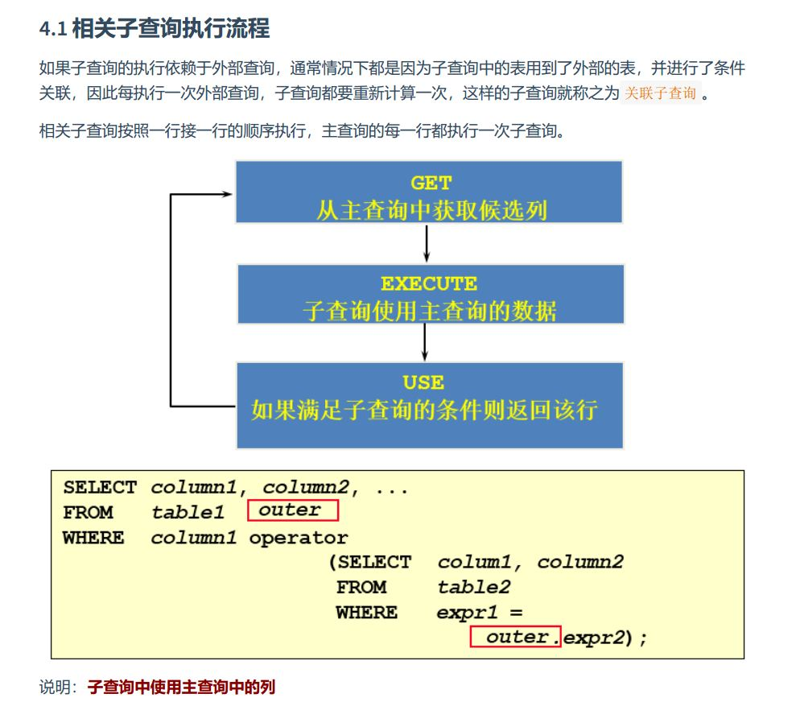	
	1. exists 和 not exists
	2. 子查询的位置非常灵活
	3. 相关更新和相关删除
	
6. 子查询和内连接的效率对比 
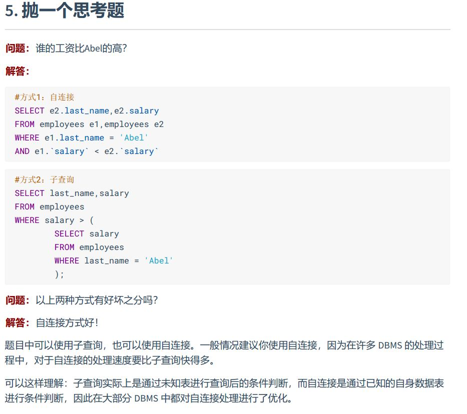
```sql
#子查询技巧总结
-- 1. 使用limit 来获取最大最小值 ，嵌套聚合函数的功能
select d.*
from departments d,
     (select department_id, avg(salary) avg_sal
      from employees
      group by department_id
      order by avg_sal
      limit 0,1) t_dept_avg_sal
where d.department_id = t_dept_avg_sal.department_id;
-- 2. 使用关联子查询
-- 3. 使用自连接，表链接来优化查询速度
```

#### 创建管理表
1. 数据类型

2. 创建管理数据库
	1. 创建数据库
	2. 使用数据库
	3. 更改数据库
	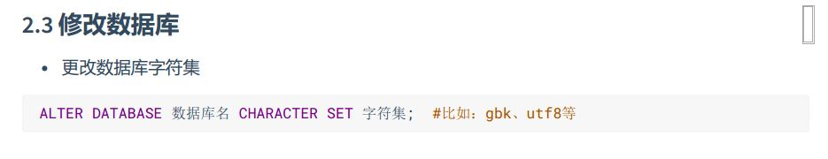
	4. 删除数据库
3. 创建表
	1. int后面加数字， 数据的显示宽度
	2. as subquery
4. 修改表
	1. 追加一个列
	2. 修改一个列
	3. 重命名一个列
	4. 删除一个列
5. 重命名表
6. 删除表
7. 清空表
8. commit 和 rollback
9. truncate 不支持事务，不可以回滚 和 delete from 可以回滚
10.  DDL 一旦执行不可以回滚 和 DML 默认情况下不可以回滚 set autocommit = false  
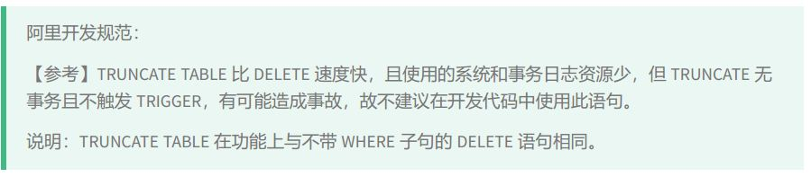

#### 数据处理之增删改查
1. 插入数据
	1. values方式
	2. 将查询结果插入到表中
	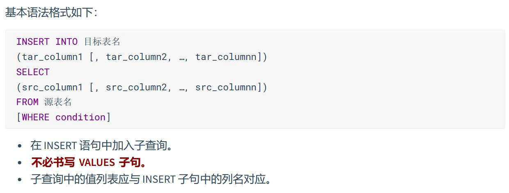
2. 更新数据
	1. 更新时的数据完整性问题
	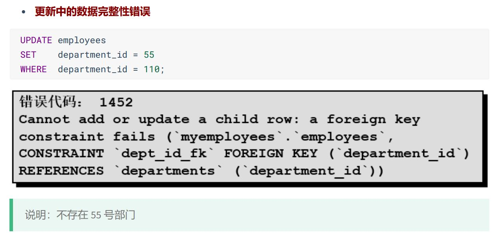
3. 删除数据
	1. 删除数据时的数据完整性问题
	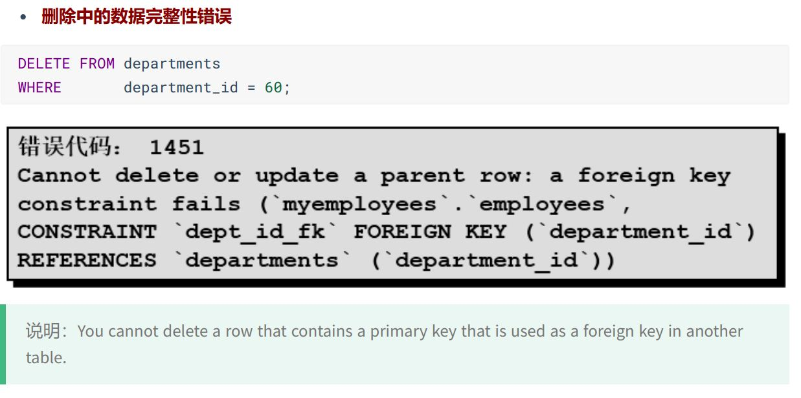
4. 计算列mysql8 新特性

#### MySql 数据类型
1. 整数类型
	1. 可选属性
		1. M
		2. UNSIGNED
		3. ZEROFILL
		！[](image/xuanze.jpg)
2. 浮点数类型
	1. float，double(M,D) 标度，精度
3. 定点数类型
	1. Decimal(M,D)
4. 位类型
	1. BIT  函数BIT(), HEX()
5. 日期和时间类型
	1. YEAR/TIME/DATE/DATETIME/TIMESTAMP
6. 文本字符串类型
	1. CHAR,VARCHAR,TEXT
7. enum类型
8. set类型
9. 二进制字符串类型
10. json类型
	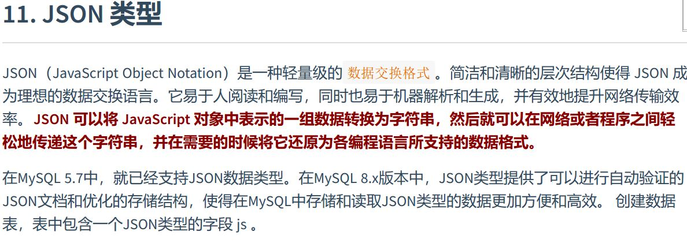
11. 空间类型

#### 约束
1. 约束
	1. 数据完整性(Data Integrity) accuracy,reliability
	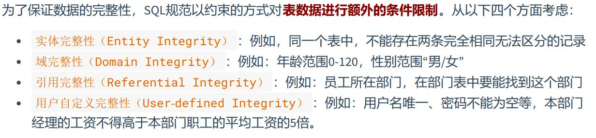
	2. 约束的分类
	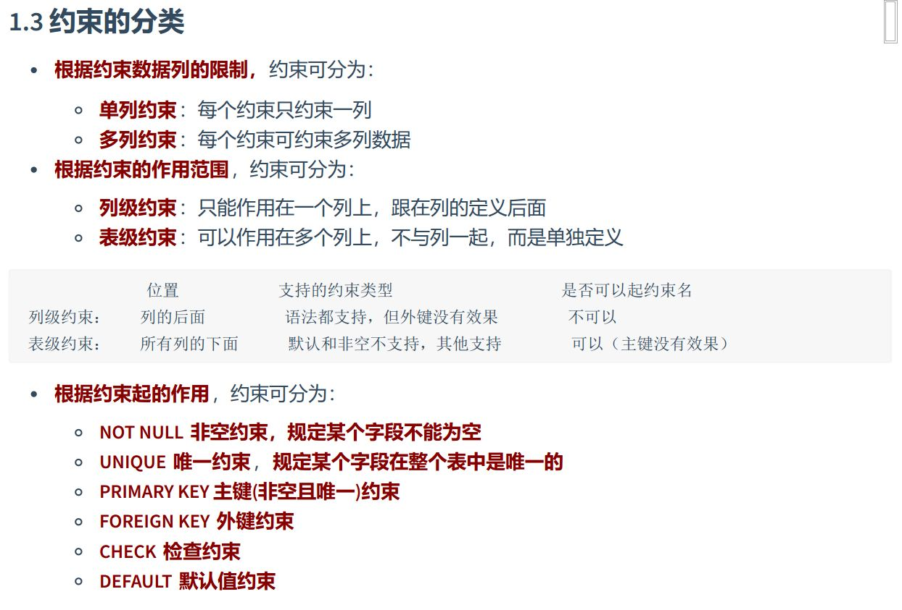
	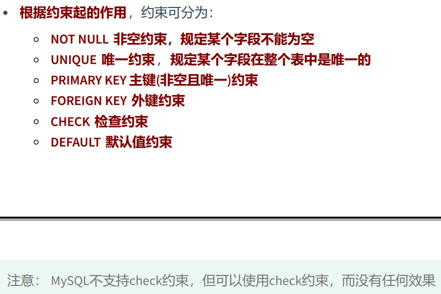   
	3. 查看表约束
	inforschema.TABLE_CONSTRAIN (view)
2. 非空约束 not null
3. 唯一性约束 unique
	1. 特点
	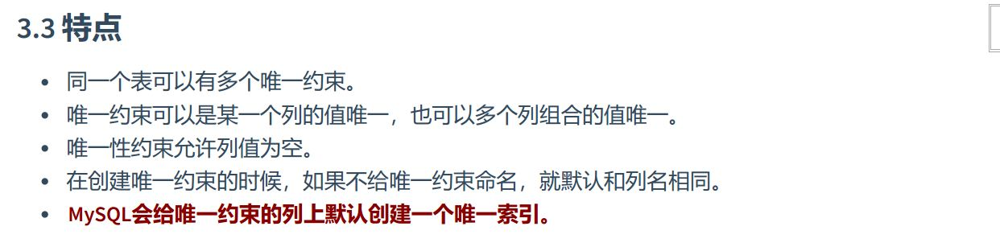
4. 主键约束 PRIMARY KEY
	1. 不要修改主键值，破坏数据的完整性
	2. 说明：删除主键约束，不需要指定主键名，因为一个表只有一个主键，删除主键约束后，非空还存在。
5. 自增列：auto_increment
	1. 特殊点
	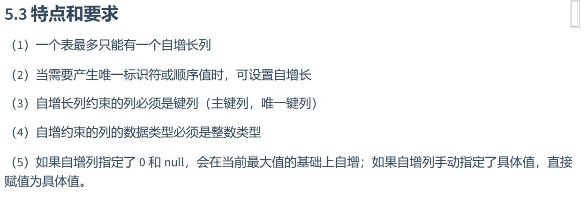
	2. mysql 8 的新特性，自增变量的持久化
6. 外键 foreign key
	1. 约束等级
	
	
7. check约束，5.7里面有，但是没用
8. default 约束

#### 视图
1. 数据库常见对象
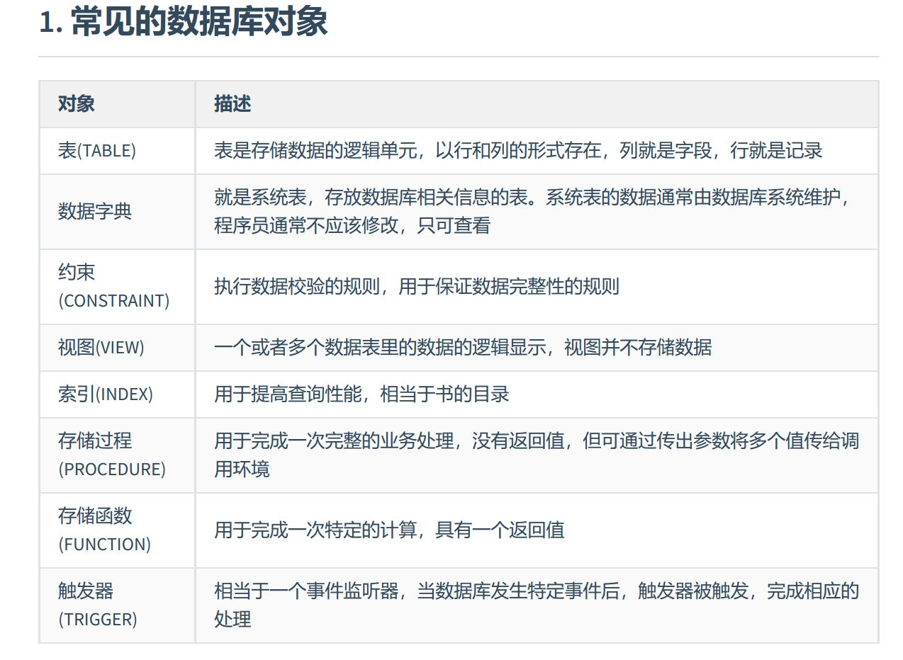
2. 视图的定义，一种虚拟表，本身不存储数据。  
3. 视图的创建
	1. 基于单表
	2. 基于多表联合
	3. 基于视图创建视图

#### 存储过程和函数

#### 变量，存储过程和游标
