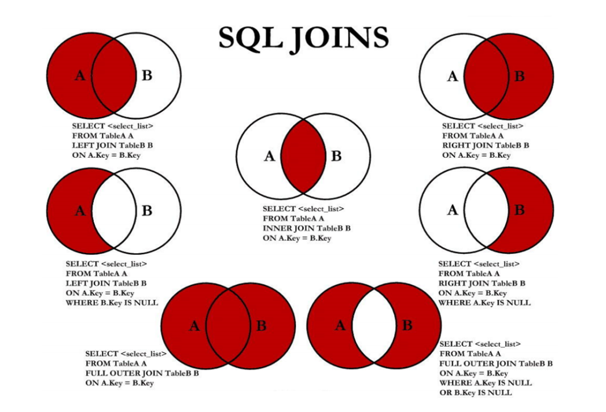
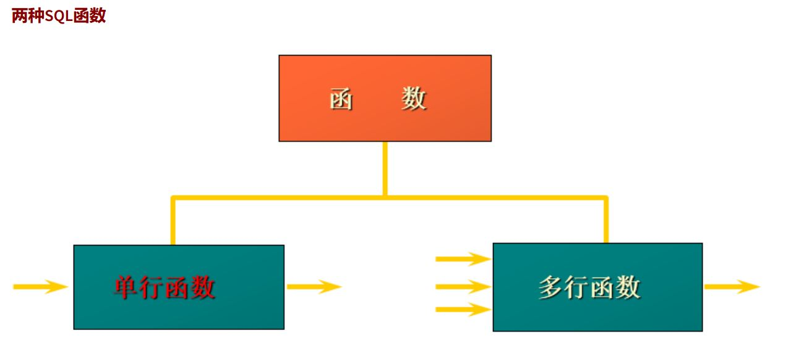
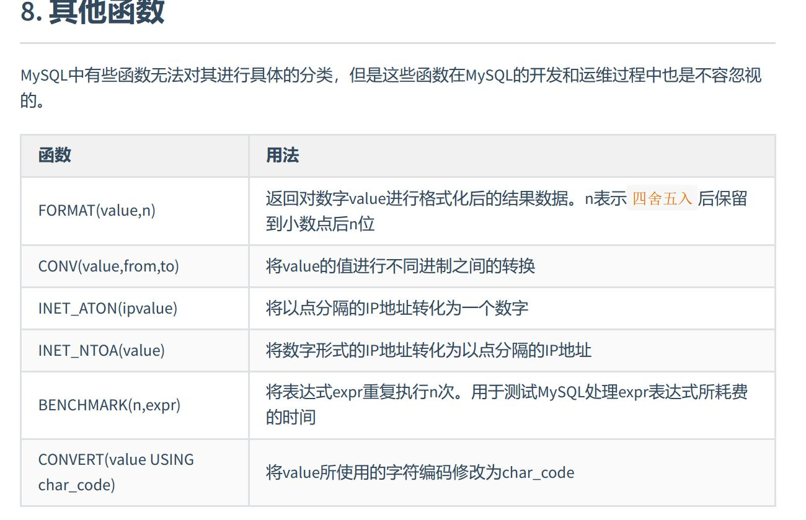
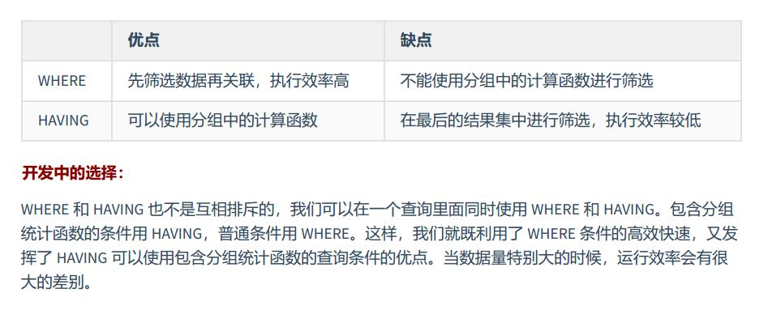
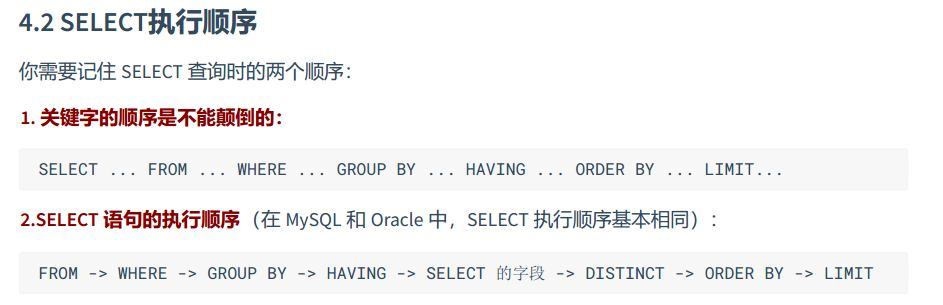
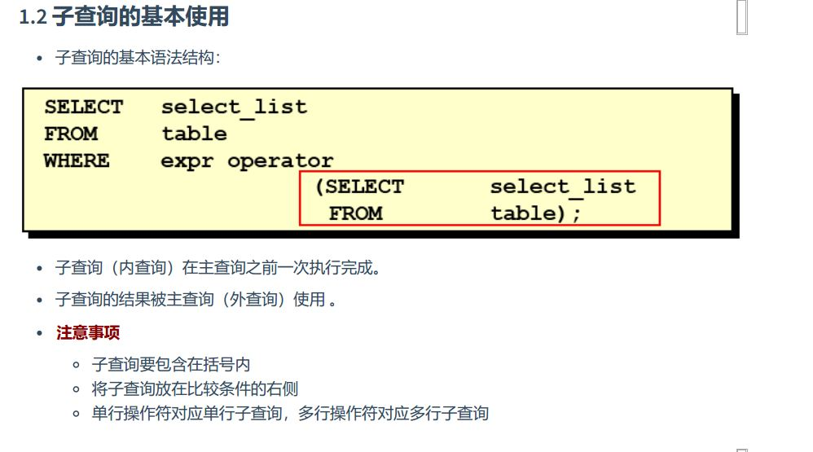
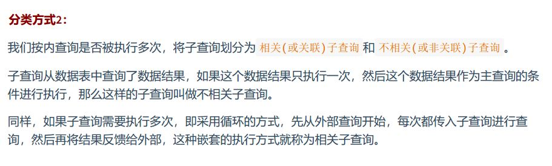
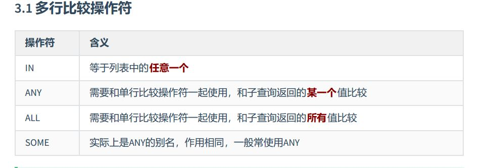

#### 01 概述
1. 单个表可存储数据量很大 几万几亿 与 文件 差别很大    
2. DB / DBMS Database Management System/ SQL  
  
#### sql 语言规范
与关键字冲突的名字要用飘号引起来  

数据导入: source + 文件地址   
  
#### select
  
目录  
1. 列的别名： as ，双引号，命名规范之类  
2. 去除重复行 ： 有关distinct的用法  
3. 空值参与运算：运算的结果都是空，空值的特殊性null  
4. 着重号：也就是飘号用来区分名字的  
5. 查询常数： select里的小功能  
6. 显示表结构：desc  
7. 过滤数据：where   
  
一般情况下，除非需要使用表中所有的字段数据，最好不要使用通配符‘\*’。使用通配符虽然可以节  
省输入查询语句的时间，但是获取不需要的列数据通常会降低查询和所使用的应用程序的效率。通  
配符的优势是，当不知道所需要的列的名称时，可以通过它获取它们。  
在生产环境下，不推荐你直接使用SELECT \*进行查询。  
  
  
#### 运算符
1. 算数运算符  
2. 比较运算符  
3. 逻辑运算符  
4. 位运算符  
5. 运算符的优先级  
6. 正则表达式  
    
  
#### 排序与分页
ORDER BY  
1. 排序规则 ascend,descend; asc,desc  
2. 单列排序  
3. 多列排序  
LIMIT(begin,length)  
   
  
#### 多表查询
1. 笛卡尔集 : 所有可能的情况  
2. 链接条件    
3. 链接的分类: (等值)（自连接，非自连接）（内连接，外链接）  
4. 外链接的分类： 左外，右外，满外（mysql不支持 Union all/Union）union 由于要去重所以效率低，所以一般都用union all   
5. 七种链接  
   
6. sql99 的新特性 natural join = 等值链接 using指定自然连接的段名    
   
#### 单行函数
1. 函数的分类  
  
2. 数值函数  
3. 字符串函数  
4. 日期和时间函数  
5. 流程控制函数  
6. 加密解密函数  
7. mysql系统信息函数   
  
  
#### 聚合函数
1. AVG(),SUM()  
2. MIN(),MAX()  
3. COUNT() 不记录null值 count( \*,1,列名)效率的差异  
4. GROUP BY 分组 WITH ROLLUP 新特性  
5. HAVING  
  
6. select 的执行过程  
  
  
#### 子查询
1. 子查询的基本使用  
  
2. 子查询的分类： 单行，多行。 相关子查询，不相关子查询  
  

3. 单行子查询
	1. 单行的比较操作符
	2. HAVING 中使用子查询
	3. case 中使用子查询
	4. 子查询中的空值问题 ： 不会返回任何行
	5. 非法使用子查询  ： 多行单行不匹配

4. 多行子查询
	1. 多行的比较操作符
	

5.