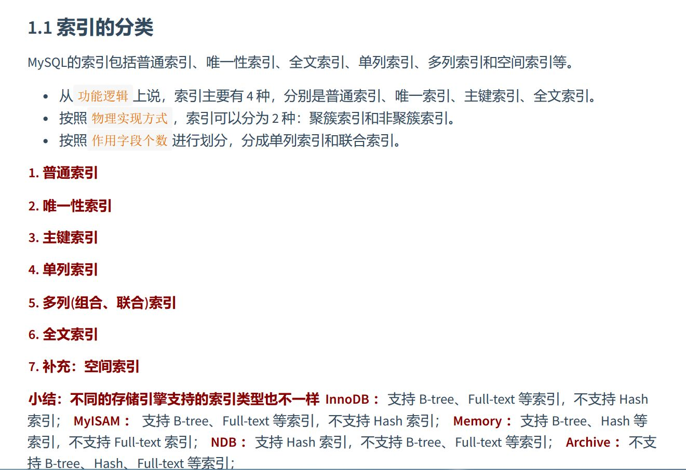

### MySql的数据目录
1. mysql8
	1. 数据库文件的存放目录: /var/lib/mysql  'datadir'
	2. 相关命令: /usr/bin   /usr/sbin
	3. 配置文件的目录： /usr/share/mysql-8.0  /etc/my.cnf
2. 数据库与文件系统
	1. 系统数据库四个 mysql,information_schema,sys,performance
	
	
	2. 数据库在文件系统之中表示为文件夹
	3. 表在文件系统之中表示
		1. inoodb引擎
			1. 系统表空间
			
			2. 独立表空间(file-per-table table space)
			.frm/.ibd
			3. innodb_file_per_table 参数
			4. general tablespace/tempory tablespace
		2. MyISAM
			1. 表结构相同 .frm
			2. 数据索引分开放的 .MYD/.MYI
3. 总结


### 用户权限和管理
1. 用户管理
	1. 创建用户 
	2. 修改用户
	3. 删除用户
	4. 修改当前用户密码
	5. 修改其他用户密码
2. 权限管理
	1. 权限列表 show privileges
	2. 授予权限 grant all privileges on \*.\* to user; 唯独不包含 权限授予 权限 。权限的不可传递性 with grant option 有赋权权限
	3. 查看权限 show grants for user;
	4. 收回权限
3. 权限表
	1. user
	2. db
	3. tables_priv , columns_priv
	4. procs_priv
4. 角色管理

### 配置文件


### 逻辑架构
  
1. sql的执行流程  
	1. @@profiling , show profiles;show profile for 
	
2. 缓冲池：存储在内存的表  
	1.   
	2. 相关设置变量  
	innoodb_buffer_pool_size  
	innoodb_buffer_pool_instance  


### 存储引擎
1. 概述
	1. 
		
	2. 默认引擎参数 storage_engine
2. 详细介绍
	1. innodb
		
	2. MyISAM
		
	3. Archive 归档索引，仅允许插入和查询
	4. Blackhole 黑洞索引
	5. csv引擎 数据存储在csv文件中，可以和excel的软件交互
	6. Memory，存储在内存中的表，使用hash索引
		！[](image/Memory.jpg)
	7. Federated 引擎：访问远程表Federated引擎是访问其他MySQL服务器的一个代理	，器的灵活性，但也经常带来问题，因此默认是禁用的。
 	8. Merge引擎：管理多个MyISAM表构成的
 	9. NDB引擎：MySQL集群专用存储引擎


### 索引的数据结构
1. 索引定义
2. 索引的分类
	1. 聚集索引：索引的叶子节点存储的是完整的用户记录
	2. 二级索引（辅助索引，非聚集索引）： 叶子节点存放了部分的用户记录。 *回表查询*
	3. 联合索引：多个字段组成的索引，也是一种二级索引。排序方式可以有升序和降序
	4. b树，b+树，二叉排序树： 二叉排序树是鼻祖，b树是为了磁盘查找来设计的，因为磁盘的特殊性，读取数据需要一块一块读，并且io时间极长，所以减少io是b树的设计目标。 由于一块一块读，一个块block就需要存储更多的可以用来查找的信息。由此，b树一个块就不放一个节点了（那就是二叉树了），放很多个节点，你自己找你所在的区间。 但是做的还不够绝， 所以b+树干脆，只放索引定义的值（主键值），其他的都放到叶子节点去。这样不仅降低了树的高度，而且宽度也同样增加了不少。数据存储能力变大，查找时间还少了，并且查找每个数据的时间一样，很稳定。甚好。
	5. 页分裂的点
3. Innodb的b+树索引的注意事项
	1. 根页面位置不动
	2. 内节点中目录项记录的唯一性
	会自动加上主键值
	3. 一个 页面最少存储两条记录
4. MyISAM中
	1. 数据和索引分离
	2. 数据按插入顺序，有定长和不定长之分，
	3. 索引算是二级索引，存标号或者直接偏移地址
	4. 回表极快
5. innodb两个例子
	1. 主键不要太长
	2. 主键最好单调，不然老是要调整树结构
	
6. Hash
	1. 只能判段 == 无法范围查找
	2. 存放上是无须的，不能order by
	3. 联合索引的时候，没把发匹配前缀，因为要匹配就匹配所有
	4. Hash不会用到重复值多的列上
	5. innodb，myisam不支持，memory支持
	6. key-value redis的核心
	7. innodb的自适应hash索引：如果页面经常被访问，就把放在hash里


### innodb的存储结构
1. 磁盘与内存的交互的基本单位： 页
	1. 16KB
	2. 页的上层结构:表空间TableSpace->段Segment->区Extent->页Page->行Row
2. 页的内部结构
	1. File Header 38 文件头
		1. FIL_PAGE-OFFSET 4 每一个页的页号，身份证号一样
		2. TYPE 3 当前页类型
		3. PREV 4   NEXT 4 数据页之间的双向链表
		4. SPAVE_OR_CHKSUM 校验和，与文件尾的校验和比对。确定缓冲池更改
		5. LSN 页面被最后修改时对应的日志序列位置
	2. Page Header 56
	3. Infimum+Supremum 26
	4. User Records
	5. Free Space
	6. Page Directory
		1.
	7. File Trailer 8
		1.
3. 行结构
	1. compact
	2. dynamic
	3. reduntant
4. 区，段和碎片区
	1. 区的存在意义 、碎片区
	2. 段的存在意义
5. 表空间
	1. 独立表空间
	2. 系统表空间
		1. innoDB数据字典

### 索引的创建和设计原则
1. 索引的分类
	
2. 创建索引 create table,alter table,create index  /  外键索引
	
3. 删除索引 alter table ... drop key;
4. 隐藏索引，软删除 INVISIBLE
5. 新的索引测试方式，隐藏索引对优化器可不可见
6. 索引的设计原则
	1. 适合加索引的原则
		1. 字段的数值有唯一性的限制 / 唯一索引对插入速度的影响微乎其微
		2. 频繁作为where查询条件的字段
		3. 经常被group by或者order by的列
		4. update delete 中的where
		5. distinct字段需要创建索引
		6. 多表join链接操作时，对where条件创建索引（超级管用），对于链接的字段创建索引（一般般没啥区别）
		7. 使用列的类型小的创建索引
		8. 使用字符串的前缀创建索引
			1. 但是无法进行索引排序
		9. 区分度高的列适合作为索引
			1. 区分度高于33就是比较高效的索引了
		10. 使用最频繁的列放到联合索引的左侧  这样也可以较少的建立一些索引。同时，由于"最左前缀原则"，可以增加联合索引的使用率。
		11. 多个字段都要创建索引的情况，联合索引优于单值索引


### 性能分析工具

1. 步骤


2. 查看系统性能参数：
	show global status; 
	成本cost 查询读取多少页

3. 慢查询日志：
	long_query_time default 10;
	mysqldumpslow
	mysqladmin flush-log slow

4. 查看sql的执行成本 
	show profile / show profiles for

5. 分析查询语句/explain
	1. table 表名
	2. id 每一个select都有一个id 注意可能被优化器优化
	3. select_type
	4. partitions
	5. type: system,const(常量匹配),eq_ref(被驱动表的唯一索引匹配),ref(非唯一索引匹配),range,index(索引树扫描，需要扫描索引书上的所有数据，比全表快一点点),all
	6. possible key  / key
	7. ken_len 所用索引长度，不固定 有计算公式
	8. ref
	9. rows
	10. filtered
	11. extra： using index， using index condition,using join buffer,using filesort
6. explain输出格式
	1. 传统，json，tree，可视化
7. show warnings
8. trace：分析优化器的执行计划
9. sys数据库的相关视图

### 索引优化与查询优化
```
维度： 
	索引建立
	关联查询太多-sql优化 
	服务器调优以及各个参数的设置（缓冲，线程树） my.cnf
	数据过多可以分库分表
	物理查询优化 利用索引 表链接方式，逻辑查询优化 写一个更好的sql。
```
1. 索引失效的案例

	1. 全值匹配最好  

	2. 最佳左前缀法则  

	3. 主键按顺序插入  

	4. 计算，函数，类型转换引起索引失效  

	5. 范围条件右边的列索引失效  

	6. 不等于索引失效  

	7. is null可以用索引，is not null不用索引  

	8. like以通配符开头不用索引  

	9. or 前后存在非索引列，索引失效  


	10. 不同字符集转化会引起索引失效  


2. 关联查询优化  
	1. 小表驱动大表，被驱动表建立索引 (A+A\*B)  
	2. join语句原理
		1. simple Nasted_loop join: A + B \* A
		2. Index Nasted_loop join: A + Deep(b) \* A + match(B) 有索引的
		3. Block Nasted_loop join : 驱动表加载到join buffer中 一块块的进行simple匹配
			bolock_nested_loop / optimizer_switch
			join_buffer_size default 256k
			总结:
			小结果集驱动大结果集
			为被驱动表建立索引
			增大join buffer size的大小
			减少驱动表不必要的字段查询（占用buffer size）
		4. Hash join（默认8.0）
	
3. 子查询优化  
	1. 由于要建立临时表，临时表没有索引。
	2. 用join来替代子查询 / 不用 not in /exists 用where ... is null
	
4. 排序优化  
	1. FileSort,index
	2. 与limit有关，与选取列有关select \* ,与索引有关
	3. FileSort 双路排序，单路排序对内存要求更高
	sort_buffer_size
	max_length_for_sort_data
	最好索引覆盖

5. group by优化  
	1. 减少使用group by，能不排序就不排序，将排序放到程序端去做。数据库的cpu资源是及其珍贵的
	2. 包含了order by，group，distinct 这些 where最好保持在1000行内

6. 优化分页查询  
	1. 使用聚簇索引

7. 优先考虑覆盖索引  
	
	理解方式一：索引是高效找到行的一个方法，但是一般数据库也能使用索引找到一个列的数据，因此它
	不必读取整个行。毕竟索引叶子节点存储了它们索引的数据；当能通过读取索引就可以得到想要的数
	据，那就不需要读取行了。一个索引包含了满足查询结果的数据就叫做覆盖索引。
	
	理解方式二：非聚簇复合索引的一种形式，它包括在查询里的SELECT、JOIN和WHERE子句用到的所有列
	（即建索引的字段正好是覆盖查询条件中所涉及的字段）。
	简单说就是，索引列+主键 包含  SELECT 到 FROM之间查询的列。
	
	覆盖索引的利弊  
	好处：
		1. 避免Innodb表进行索引的二次查询（回表）
		2. 可以把随机IO变成顺序IO加快查询效率
	弊端：
		索引字段的维护总是有代价的。因此，在建立冗余索引来支持覆盖索引时就需要权衡考虑了。这是业务
		DBA，或者称为业务数据架构师的工作。
8. 如何给字符串添加索引  
	索引长度

9. 索引下推 icp   
	减少回表操作

10. 普通索引 和 唯一索引  
	
11. 其他优化策略  
	1. EXISTS 和 IN 的区分 (exists 最好用在大表，找到就不找了，in用在小表)
	2. count(\*) 和 count(具体字段)（count* 会自动优化用，长度小的二级索引）
	3. select \* （需要系统查询数据字典，比较费时）
	4. limit 1 （找到一个就不找了）
	5. commit

淘宝数据库主键设计：
自增id的问题：
	1. 可靠性不高，存在id回溯的问题，8.0才解决
    2. 安全性不高
    3. 性能差
    4. 交互太多
    5. 局部唯一性，不是全局唯一，对分布式系统来说不合适
    

### 数据库的设计规范
1. 范式
	在关系型数据库中，关于数据表设计的基本原则、规则就称为范式。可以理解为，一张数据表的设计结
	构需要满足的某种设计标准的级别。要想设计一个结构合理的关系型数据库，必须满足一定的范式。

	范式为了减少冗余，但是增加了表的查询难度，保留适当的冗余是合理的

2. 反范式化
3. er模型
4. 编写建议：见pdf

### 数据库其他调优

### 事务的基础知识
1. 事务是数据库区别与文件系统的显著特征innodb支持
2. 基本概念: 一组逻辑操作单元，从一种状态换到另一种状态，要么全部提交，要么回滚
3. acid
	1. 原子性 atomicity 这组操作不可分割，
	2. 一致性consistency 与现实中我的要求合不合法，
	3. 隔离性 isolation 一个事务的执行不能被其他的事务干扰，
	4. 持久性 durability 事务一旦提交，对数据库中的数据的更改是永久的
4. 事务的状态
	1. active
	2. partially commited
	3. failed
	4. aborted
	5. committed
	
5. 事务的使用
	1. 显式事务
		1. start transaction 可以加参数 read only，read write，with consistent snapshot 启动一致性读
		2. commit，rollback，rollback to [savepoint]
		3. savepoint s1 ,release savepoint s1;
	2. 隐式的事务
		autocommitted
	3. 数据并发问题
		1. 脏写 事务a修改了事务b未提交的数据
		2. 脏读 事务a读取了事务b修改未提交的数据
		3. 不可重复读 事务a在本事务执行过程中，读到了其他事务修改提交了以后的数据
		4. 幻读 读不出来，插不进去
	3. 事务的隔离级别
		1. read uncommitted 
		2. read committed
		3. repeatable read
		4. serializable
	
### 事务日志
1. 事务的隔离性 是由锁机制实现的，剩下的原子性，持久性，一致性是由日志来实现的

2. redo log ： 重做日志 恢复提交的事务对数据的操作    改磁盘中的数据  持久性

3. undo log ： 回滚日志 原子性一致性

4. （存储引擎层的日志）redo 和 undo 都是一种恢复操作，redo是物理级别的页修改操作 undo是 逻辑操作日志。

5. redo log
	1. 脏页以固定频率刷入磁盘（checkpoint机制） 
	
	2. 为什么需要redo日志，修改内容在内存里面，宕机就都没了
	
	3. Write-ahead logging 先写日志，再写磁盘，只有日志写入成功了以后，才算事务提交成功了redo日志在事务执行过程中不停地写入磁盘
	
	4. redo 的组成
		1. redo log buffer ，保存在内存中，容易失去的，*16m 若干redo log block 512byte*
		2. redo log file（ib_logfile） 保存在磁盘上 48M
		
		3. redo log 的刷盘策略：刷到文件系统缓存中，page cache
		
		innodb_flush_log_at_trx_commit 参数
		0： 每次事务提交时不进行刷盘操作（系统默认master thread 每隔一秒进行一次同步
		1： default 事务提交的时候进行同步
		
		2： 每次事务提交只把redo log 写入page cache 不进行同步 由os决定什么时候进行同步
	
	   
	
	   
	
	   