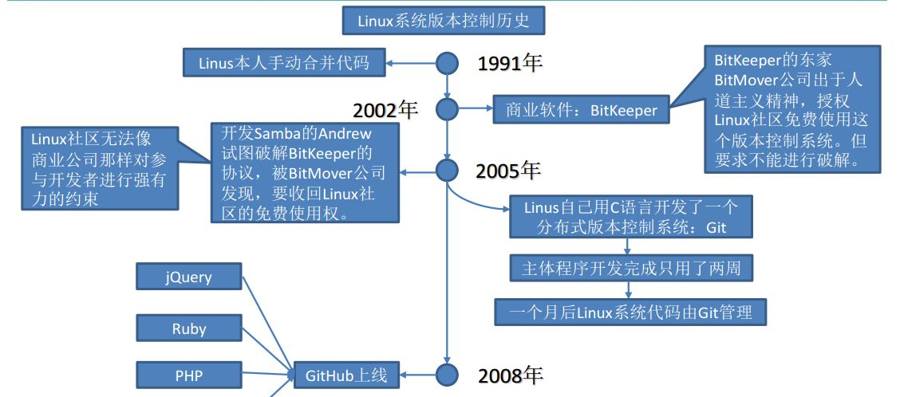

### Git
1. 免费的开源的分布式版本控制系统

2. 版本控制工具
	1. 集中式版本控制（CVS,SVN,VSS...）
		集中化的版本控制系统诸如  CVS、SVN等，都有一个单一的集中管理的服务器，保存
		所有文件的修订版本，而协同工作的人们都通过客户端连到这台服务器，取出最新的文件或者提交更新
	2. 分布式版本控制工具（Git，Mercurial，Bazzar...）
		像Git这种分布式版本控制工具，客户端提取的不是最新版本的文件快照，而是把代码
		仓库完整地镜像下来（本地库）。这样任何一处协同工作用的文件发生故障，事后都可以用其他客户端的本地仓库进行恢复。因为每个客户端的每一次文件提取操作，实际上都是一次对整个文件仓库的完整备份。
3. 发展

4. Git的工作机制
	工作区 --git add --> 暂存区 --git commit --> 本地库
