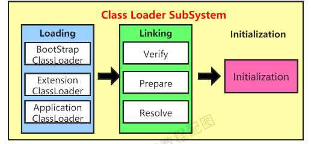
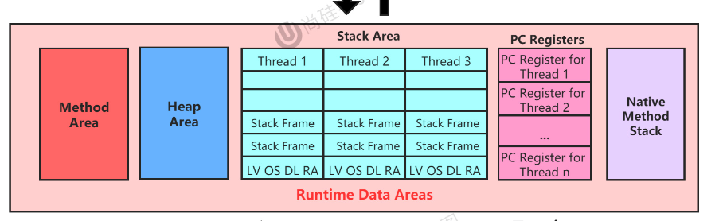

# CLASS LOADER SUBSYSTEM
负责从文件系统或者网络加载Class文件，放到 内存空间中的方法区 里。 方法区里包含： 运行时的常量池信息，字符串字面量 和 数字字面量


loading -> Linking -> Initialization   



## Loading
通过一个类的全类名，获取定义这个类的二进制字节流

将这个字节流转化为方法区的 运行时数据结构

在内存中生成一个代表这个类的java.lang.Class对象

1. 加载器分类
	- 启动加载器：BootStrapClassLoader c/c++写的 无法获得
	- 用户自定义加载器： 实现了ClassLoader接口的：ExtensionClassLoader,ApplicationClassLoader,....

2. parents elegate: 父辈委派
	- 第一保证安全，核心代码不会被篡改
	- 第二保证不会重复加载

## Linking
1. Verify
	- 确保Class文件安全，完整

2. Prepare
	- 为类变量，静态变量分配内存，设置初始值

3. Resolve
	- 将符号引用转化为直接引用

## 初始化
1. 执行```<clinit>``` 方法的过程
2. 该方法不用定义，由javac编译器自动收集类中所有类变量的赋值操作和静态代码块中的语句合并而来
3. 必须保证该方法在多线程下被同步加锁

# 运行时的数据区
    

## Stack Area
### Stack Frame === Method
1. 局部变量表
	- 数组，放变量的地方

2. 操作数栈
	- 进行计算的‘寄存器’ 类似，但不是
	- 唯一栈

3. 方法返回地址
4. 动态链接
5. 方法的调用
	- 字节码装入内存，如果调用的方法在编译期间就可以知道 为 静态链接 否则为动态链接
	- 早期绑定，晚期绑定。范围更大一些，包括字段，方法，类
6. 虚方法与非虚方法，以及字节码指令
7. 动态类型语言，静态类型语言
	- 对类型的检查实在编译器还是在运行期
8. 为了提高效率 jvm在方法区建立了一个虚方法表，在类加载的链接阶段创建

## Native Method Stack
1. 本地方法栈也是线程私有的
2. 允许被设计为可动态扩展的
3. 当某个线程调用一个本地方法的狩他就进入了一个全新的并且不受虚拟机限制的世界，他和虚拟机拥有一样的权限
4. 并不是所有的java虚拟机都支持本地方法

## Heap 堆
1. 堆内存大小可以调节的
2. 堆物理上可以是不连续的，逻辑上必须是连续的
3. 所有的线程都共享堆，但是可以划分私有的线程空间
4. 有栈上分配的例外

### 内存的细分
1. 分代收集理论 逻辑上
	- 新生区
		+ Eden,Survivor区
		+ 幸存者区只有一个方数据
	- 养老区
	- 永久区7/元空间8 事实上不包含这个
2. 参数
	- -Xms10m -Xmx10m
	
3. 设置堆空间内存大小和OOM
	- -Xms = -XX:InitialHeapSize   memorystart
	- -Xmx = -XX:MaxHeapSize       memorymax
	- -X是jvm运行参数
	- 默认初始内存大小，物理电脑内存大小/64最大内存大小 /4
	- 开发当中建议将堆初始和最大设置成一样的
	- -XX：+printGCDetails

4. 年轻代老年代
	- 根据生命周期长短有两种对象
	- YoungGen,OldGen
	- YoungGen
		+ Eden,survior0 from ,Survivor1 to
	- -XX:NewRatio = 2 默认 young/old 比例
	- 声明周期长的对象比较多就把老年代调多一点
	- 默认情况下Eden 和 Survivor 0 1 的比例是8:1:1
	- 调整参数为-XX:SurvivorRatio来调整
	- -XX：-UseAdaptiveSizePolicy自适应机制
	- -Xmn： 设置新生代的空间大小

5. 对象转移的过程  阈值 15可以使用-XX:MaxTenuringThreshold=<N>来修改
6. Minor GC,Major GC,Full GC
	- 部分收集
		+ 新生代收集：只是新生代的收集minor gc/young gc
		+ 老年代收集：只是老年代的收集major gc/old gc
			* 目前，只有cmsgc会有单独收集老年代的行为
		+ 混合回收mixed gc
			* 目前只有g1 gc
	- 整堆收集 full gc，整个java堆以及方法区的垃圾收集
7. 老年代gc
	- 出现了Majorgc一般都会伴随至少一次的minorgc，也就是老年代空间不足了会先尝试minorgc，如果空间还是不足，才会majorgc
	- 比minorgc慢10倍
	
8. Full gC
	- 调用System.gc()
	- 老年代空间不足
	- 方法区空间不足

9. 内存分配的策略
	1. 优先分配到Eden
	2. 大对象直接分配到老年代
	3. 长期存活的对象分配到老年代
	4. 动态对象年龄判断
	5. 空间分配担保
		- -XX：HandlePromotionFailure

10. TLAB Thread Local Allocation Buffer
	1. Eden里面 每个线程单独有一份缓冲区
	2. 快速分配方式
	3. -XX：+UseTLAB
	4. -XX：TLABWasteTargetPercent

11. 代码优化策略
	- 逃逸分析 -XX:+DoEscapeAnalysis  -server
	- 栈上分配
	- 同步策略 
	- 标量替换 -XX:+EliminateAllocations

## 方法区
jdk 8 以前，方法区放在jvm内存里。8 之后放在native heap 里，改名较为meta space


1. 交互关系
2. 设置方法区大小
	- -XX:PermSize -XX:MaxPermSize
	- -XX:MetaspaceSize100m
3. 类信息，常量，静态变量，及时编译器编译后的代码缓存等 

4. 方法区的演化
	- 1.6 有永久代，静态变量放在永久代上
	- 1.7 有永久代，字符串常量池，静态变量移除保存在堆里面
	- 1.8 没有永久代，类型信息，字段方法，常量保存在本地内存的元空间中，字符串常量池，静态变量还在堆里面

5. 方法区的垃圾回收
	
## 对象的实例化内存布局和访问定位
1. 创建对象的方式
	- new
	- Class.newInstance()
	- COnstructor.newInstance()
	- clone()
	- 反序列化
	- 第三方库

2. 步骤
	- 判断对象对应的类是否加载链接初始化
	- 为对象分配内存
		+ 内存规整 指针碰撞
		+ 内存不规整
			* 维护一个列表
			* 空闲列表分配
	- 处理并发安全问题
	- 初始化分配到的空间，所有的属性设置默认值。
	- 设置对象的对象头，取决于jvm设置
	- 执行init方法初始化

3. 对象的内存布局
	- Header
		+ 运行时元数据mark word
			* hashcode
			* gc分代年龄
			* 锁状态
			* 线程持有的锁
			* 偏向线程id
			* 偏向时间戳
		+ 类型指针 指向类源数据instanceClass
	- Instance Data
	- Padding

4. 对象访问定位
	- 句柄访问
	- 直接指针hotspot

## 直接内存 direct memory
1. 直接向系统申请的内存
2. 来源于NIO，通过堆DirectByteBuffer来操作Native 内存


# 执行引擎
1. JIT编译器
	- 栈上替换 On Stack Replace
	- 基于计数器的热点探测
	- 方法调用计数器
	- 回边计数器
	- 热度衰减
	- xx:UseCounterDecay
	- xx:CounterHalfLifeTime     
	设置模式    
	- Xint (erperted)
	- Xcomp (iler)
	- Xmixed 
	- c1,c2 Client Compiler,Server Compiler
2. c1 的优化策略
	- 方法内联
	- 去虚拟化
	- 冗余消除
3. c2 的优化策略
	- 标量替换
	- 栈上分配
	- 同步消除
	
## StringTable
1. 


# JNI & Native Method Libray
1. 本地方法，native method 是 java调用非java语言的接口
2. 使用native method的原因
	- 与java环境外交互
	- 与操作系统进行交互
	- Sun's Java底层是用c写的
	


## 垃圾回收

### 垃圾回收的算法
垃圾标记阶段
1. 引用计数算法
	- 对每一个对象保存一个引用计数器
2. 可达性算法
	- 根搜索算法，追踪性垃圾收集
	- 以根对象集合为起始点，按照从上至下的方式搜索被根对象集合所链接的目标对象是否可达
	- 所有所走过的路径成为引用链
	- 如果对象没有任何引用连相连测试不可大的
	- 只有直接或者简介被根对象集合链接的对象才是存活对象
3. GCRoots包括以下几种元素
	- 栈中引用的对象
	- jni引用的对象
	- 静态属性引用的对象
	- 常量引用的对象
	- 同步所持有的对象
	- 虚拟机内部的引用


### ClassLoader
1. SercureClassLoader
2. URLClassLoader:
	1. ExtClassLoader
	2. AppClassLoader

3. Class.forName vs ClassLoader.loadClass 一个主动使用一个被动使用


### 双亲委派的破坏
1. 优势
	- 保护核心api的源码不被替换
	- JDK 提供了一层保护机制，defineClass里面有一个predefine方法提供了保护
2. 弊端
	

### SPI
1. Service Provider Interface 是Java提供的一套用来被第三方实现或者扩展的API


### 性能监控与调优
1. 