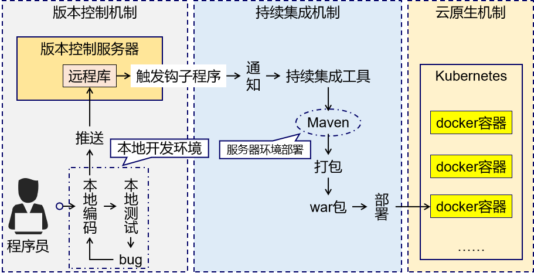
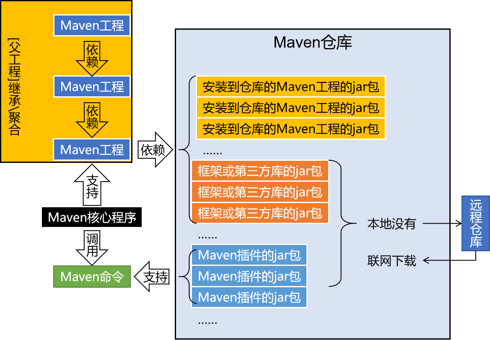

## 第一节 为什么要学习Maven？
  
### Maven 作为依赖管理工具
  
1. jar 包的规模  
2. jar 包的来源  
3. jar 包之间的依赖关系  
  
### Maven 作为构建管理工具
  
  
## 第二节 什么是maven  
### Maven是Apache软件基金会组织维护的一款专门为Java项目提供构建和依赖管理支持的工具  
  
1. 构建包括的主要环节:  
	清理：删除上一次构建的结果，为下一次构建做好准备  
	编译：Java 源程序编译成 \*.class 字节码文件  
	测试：运行提前准备好的测试程序  
	报告：针对刚才测试的结果生成一个全面的信息  
	打包  
		Java工程：jar包  
		Web工程：war包  
	安装：把一个 Maven 工程经过打包操作生成的 jar 包或 war 包存入 Maven 仓库  
			部署  
	部署 jar 包：把一个 jar 包部署到 Nexus 私服服务器上  
	部署 war 包：借助相关 Maven 插件（例如 cargo），将 war 包部署到 Tomcat 服务器上  
  
  
## maven的设置
1. mirror源的设置  
2. jdk的设置  
3. 环境变量的设置，maven也需要java运行环境  
  
## maven 的使用  
### 一、根据坐标创建 Maven 工程  
  
1. 坐标  
	Maven中的坐标  
	[1]向量说明  
		使用三个『向量』在『Maven的仓库』中唯一的定位到一个『jar』包。  
	  
	groupId：公司或组织的 id  
	artifactId：一个项目或者是项目中的一个模块的 id  
	version：版本号  
	  
	[2]三个向量的取值方式  
	groupId：公司或组织域名的倒序，通常也会加上项目名称  
		例如：com.atguigu.maven  
	artifactId：模块的名称，将来作为 Maven 工程的工程名  
	version：模块的版本号，根据自己的需要设定  
			例如：SNAPSHOT 表示快照版本，正在迭代过程中，不稳定的版本  
			例如：RELEASE 表示正式版本  
	  
	举例：  
		groupId：com.atguigu.maven  
		artifactId：pro01-atguigu-maven  
		version：1.0-SNAPSHOT  
	例子  
	```xml  
		<groupId>javax.servlet</groupId>  
  		<artifactId>servlet-api</artifactId>  
  		<version>2.5</version>  
  	```  

2. maven的创建指令  

	
pom.xml的解读:
```xml
  	<!-- 当前Maven工程的坐标 -->
  <groupId>com.atguigu.maven</groupId>
  <artifactId>pro01-maven-java</artifactId>
  <version>1.0-SNAPSHOT</version>
  
  <!-- 当前Maven工程的打包方式，可选值有下面三种： -->
  <!-- jar：表示这个工程是一个Java工程  -->
  <!-- war：表示这个工程是一个Web工程 -->
  <!-- pom：表示这个工程是“管理其他工程”的工程 -->
  <packaging>jar</packaging>

  <name>pro01-maven-java</name>
  <url>http://maven.apache.org</url>

  <properties>
	<!-- 工程构建过程中读取源码时使用的字符集 -->
    <project.build.sourceEncoding>UTF-8</project.build.sourceEncoding>
  </properties>

  <!-- 当前工程所依赖的jar包 -->
  <dependencies>
	<!-- 使用dependency配置一个具体的依赖 -->
    <dependency>
	
	  <!-- 在dependency标签内使用具体的坐标依赖我们需要的一个jar包 -->
      <groupId>junit</groupId>
      <artifactId>junit</artifactId>
      <version>4.12</version>
	  
	  <!-- scope标签配置依赖的范围 -->
      <scope>test</scope>
    </dependency>
  </dependencies>
```

3. Maven核心概念POM
4. Maven核心概念：约定的目录结构
	约定大于配置

5. 一些命令:
	mvn clean
	mvn compile
	mvn test-compile
	mvn test
	mvn package
	mvn install

6. mvn archetype: 这里可以上官网找响应的模板，例如webapp：

<mark>ps: webapp表示bs架构的web应用，j2ee比webapp要复杂很多</mark>.

## 依赖
1. scope标签表示jar包的作用域 常用的有有 compile test provided 

2. compile标记的jar包可以有依赖传递

3. 依赖的排除 在需要排除依赖的jar包的dependency 标签中添加 exclusions:exclusion标签即可


## 继承 和聚合
本质上是 A 工程的 pom.xml 中的配置继承了 B 工程中 pom.xml 的配置。  
在父工程中统一管理项目中的依赖信息，具体来说是管理依赖信息的版本。  

module标签和parent标签